# Levoks completion matrix

## Checkbox group authoring and submissions — 2026-10-10

Checkbox Group is now available through the tray and Form Content. It reuses the radio choice editor for question/name/Required, labels distinct from values, independent defaults, disabling and Add/Apply/Up/Down/Remove. Direct children remain ordinary native checkboxes. The group owns one stable array/body mapping; child edits/removal/reorder retain that identity, while standalone consent remains boolean. Copies get independent names, and locked or linked structural edits fail atomically. Removing a connected group's last enabled choice requires disconnecting/remapping first.

Required means at least one enabled choice, with associated visible instructions, accessible form status and focus recovery before posting. Optional empty/disabled groups are omitted from requests; existing Mongoose array schemas retain their native empty-array storage default. New guided collections snapshot enabled unique values into ordinary oneOf/Required rules. Backend snapshots stay unchanged after later edits and need explicit review. Import/compiler validation covers malformed names/labels/values/defaults and mixed children, including reusable definitions. Connected required groups without enabled choices also fail compiler contract validation, covering generic deletion outside the composite editor. Bounds are 1–200 unique single-line values, 10,000 characters total and 200-character labels. Empty unconnected groups remain editable; empty/all-disabled groups block guided collection creation.

Acceptance: `npm run check` passes all 155 unit tests, TypeScript and lint (zero errors; 49 existing warnings). Six distinct browser journeys pass across both checkbox journeys, broader forms, select metadata and both radio tests. Direct tray group growth/containment and actual form drag/drop, invalid edit recovery, multiple defaults, disabling, keyboard reorder/focus, mapped removal, undo/redo, completed save/reload, generated preview and real ZIP are checked. Generated Next/Express and final editor production builds pass, along with after-build typecheck and private-output packaging checks; all 39 downloaded files match the final compiler and production fixture. Actual downloaded production Next/Express/MongoDB execution verifies array/value storage, standalone consent, Required focus/error recovery before any POST, fourteen forged/missing/wrong-type/duplicate/disabled/consent requests without writes, optional omission, native reset, outage/restart/retry and reload. Form/group containment and wrapped labels pass at 320/768/1024/1440px; desktop/compact/mobile screenshots were reviewed.

Initial verification caught a lightweight DOM mock without closest(), a stale responsive CSS assertion, a transient Next generated-types race and a reused server shutting down between test cases. The serializer guards optional DOM methods, the CSS assertion checks actual breakpoint width and inherited positioning, and affected focused/full/browser suites were rerun successfully. The first runtime harness expected absent optional arrays in MongoDB; it now explicitly verifies the existing Mongoose empty-array default alongside request omission. A final empty-name import check caught a harness mutation of a live capture; the malformed fixture now clones the snapshot first, and the affected ten-unit rerun passes. These corrections did not bypass validation or alter model semantics.

Evidence under `.verification/`: `checkbox-unit-final.log`, `checkbox-contract-final.log`, `checkbox-regression.log`, `checkbox-browser.log`, `checkbox-browser-final.log`, `checkbox-select-regression.log`, `checkbox-tray-final.log`, `checkbox-check-final.log`, `checkbox-refresh.log`, `checkbox-front-build.log`, `checkbox-back-build.log`, `checkbox-runtime-final.log`, `checkbox-editor-build-final.log`, `checkbox-typecheck-final.log`, `checkbox-packaging-final.log`, `checkbox-lint-final.log` and `checkbox-parity.log`. The mixed browser log records the shared-server shutdown; checkbox and broader forms passed there, and the standalone select rerun passed. `npm run test:checkbox-export` reproduces the complete checkbox workflow. All execution stays local.

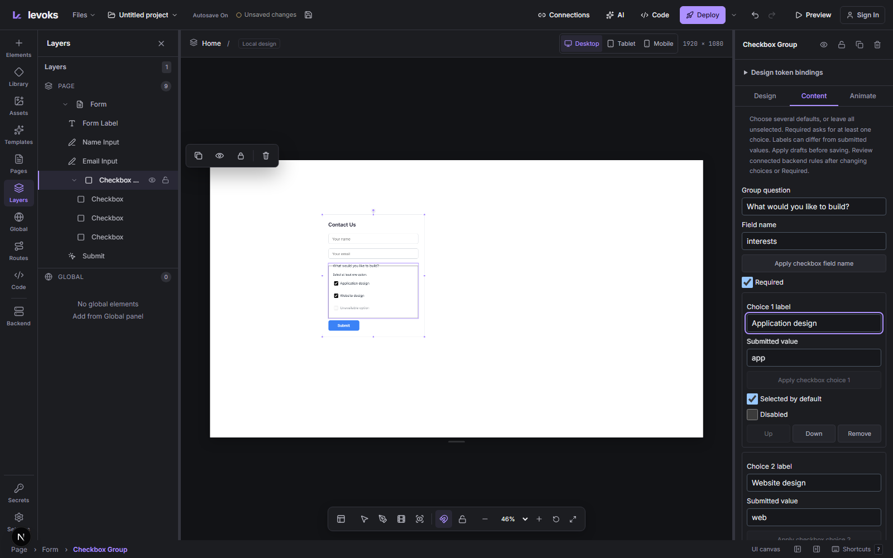
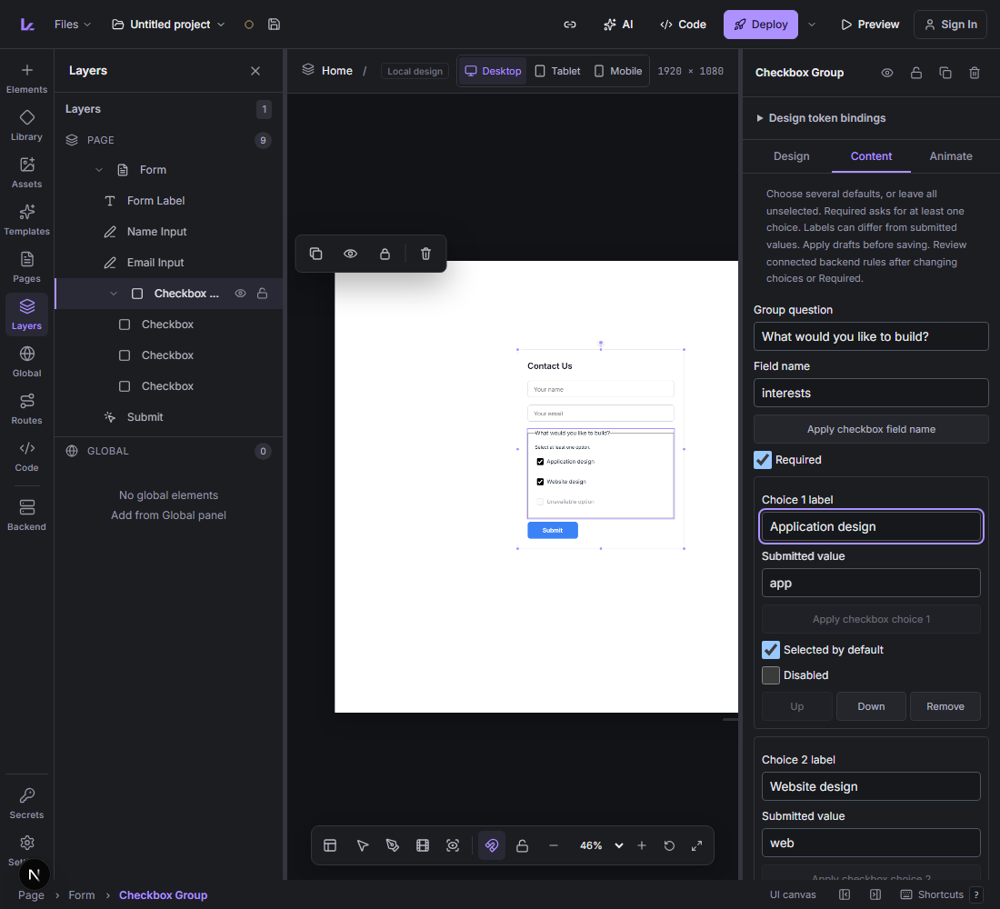

UX11/UX24/SEM05 remain PARTIAL. Conditional forms, selection-count bounds, nested/mixed composites, whole-group shortcuts, component structure, general nested geometry, complete site starters and catalog-wide screen-reader/touch acceptance remain. Point 4 continues, followed by the documented point 5–6 work. See [checkbox contracts](fullstack-contracts.md#checkbox-group-submissions).

## Native select option groups — 2026-10-10

Select and Multiple Select choices now expose an optional Group in Add and Apply rows. Group names produce native optgroup headings; a single checkbox disables all runs of that named group. Disabling clears affected defaults atomically, prevents selecting them as defaults and retains each choice's separate Disabled setting. Re-enabling does not silently restore cleared defaults. Assignments follow values through rename, reorder, removal, bulk lists, history and completed save/reload; removed groups lose their disabled metadata. Ungrouped choices remain ordinary options, and authored order is preserved. Adjacent matching names share a heading; separated runs intentionally render another heading rather than moving choices silently.

Optional newline `optionGroups` metadata aligns with option values, retaining blank entries for ungrouped choices. `disabledGroups` contains existing unique group names. Names are single lines of at most 100 UTF-16 units, with at most 10,000 characters per list. Invalid alignment, whitespace-only/oversized names, unknown/duplicate disabled groups and disabled-group defaults fail import/compiler validation, including reusable definitions. No new element, dependency or saved-project migration is added. Native HTML defaults now also select options inside groups, matching the shared React/canvas tree.

Acceptance: all 152 unit tests, TypeScript and lint pass (zero errors; 49 existing warnings). Four browser cases pass: the expanded actual drag/drop select journey and existing broader forms plus both radio journeys. Group assignment/error recovery, bulk reorder retention, disabling/default clearing, undo/redo, re-enabling, desktop/compact containment, completed save/reload, frontend preview and actual ZIP parity are verified. All 39 downloaded files match the final compiler and production fixture; generated Next/Express builds and final editor production build pass, as do after-build typecheck and private-output packaging checks.

Actual downloaded production Next/Express/MongoDB execution verifies native optgroups with disabled parents and enabled child attributes, grouped/ungrouped default selection, Required and keyboard navigation past disabled groups, scalar/array storage of submitted values, fifteen forged/wrong-type/label/disabled submissions without writes, native reset, optional omission, visible disabled-selection recovery, outage/restart/retry and reload. Four-width form containment/non-overlap passes at 320/768/1024/1440px. Desktop/compact/mobile screenshots were reviewed. New guided collections exclude values in disabled groups; existing backend models/rules and routing identities remain unchanged after later edits and require explicit rule review. All-disabled collections fail before backend mutation.

Evidence under `.verification/`: `optgroups-unit.log`, `optgroups-check-final.log`, `optgroups-browser.log`, `optgroups-refresh.log`, `optgroups-front-build.log`, `optgroups-back-build.log`, `optgroups-runtime.log`, `optgroups-editor-build.log`, `optgroups-typecheck-final.log`, `optgroups-packaging.log` and `optgroups-parity.log`. `npm run test:select-metadata-export` now reproduces the expanded grouped workflow. The initial lint check caught an unescaped apostrophe in new help text; it was corrected before the passing full check. All execution remains local.

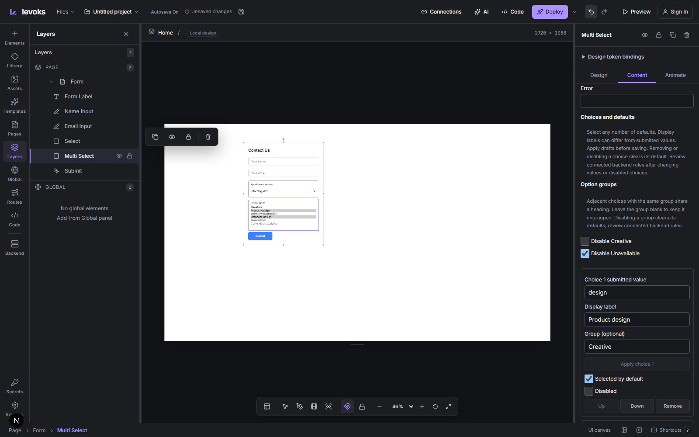
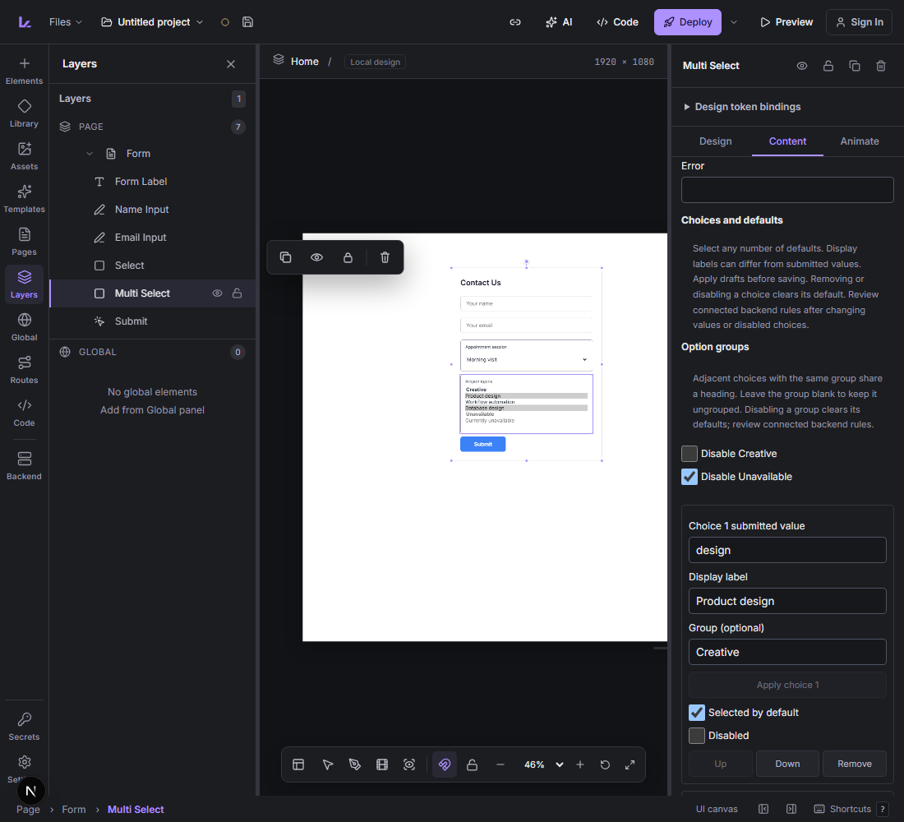

UX11/UX24/SEM05 remain PARTIAL. Conditional forms, multi-checkbox composites, whole-group editing shortcuts, reusable-component structure, general nested geometry, complete site starters and catalog-wide screen-reader/touch acceptance remain. Point 4 continues; points 5–6 retain their documented work. See [group contracts](fullstack-contracts.md#native-select-option-groups).

## Select display labels and disabled choices — 2026-10-10

Native Select and Multiple Select Content now separates display labels from submitted values and exposes per-choice Disabled. Defaults remain attached to values through label/value edits, reorder, removal and undo/redo. Disabling clears a choice's default and makes its default checkbox unavailable. Duplicate display labels are permitted; submitted values must be unique. Old documents without optional metadata retain their original text/value rendering. Bulk text edits are drafts until Apply text lists: unchanged values retain labels/disabled state and invalid defaults fail visibly without partial writes.

Optional newline `optionLabels` and `disabledValues` properties use the existing element schema. Import/compiler validation checks metadata lengths, alignment, values, disabled membership and default selections, including elements in component definitions. Native canvas/HTML/React output shares the same choice tree. Guided destinations snapshot only enabled submitted values; existing backend models, rules and mappings remain unchanged after later edits and require explicit review. Collections with no enabled allowed values fail before backend mutation. The generated serializer omits disabled optional single selections, rejects required disabled single selections visibly before posting and excludes disabled multiple selections.

Acceptance: 150 unit tests pass, TypeScript passes and lint has zero errors (49 existing warnings). Four browser cases cover the new real drag/drop select journey plus existing broad/nested forms and both radio-group workflows. The select journey verifies distinct labels/values, default retention on renames, duplicate/blank-label recovery, disabling, keyboard reorder/focus, history, bulk-list recovery, completed save/reload, preview and actual ZIP parity. Unit coverage also verifies unchanged backend/routing snapshots after edits to connected selects. All 39 downloaded files match the final compiler and production fixture; generated Next/Express and final editor production builds pass. After-build typecheck and private trace/standalone packaging checks pass.

Actual downloaded production Next/Express/MongoDB execution verifies native Required and keyboard navigation past disabled options, exact scalar/array value storage, fifteen malformed/label/disabled submissions without writes, default reset, optional omission, explicit disabled-selection recovery, outage/restart/retry and reload. Form containment and non-overlap pass at 320/768/1024/1440px. Desktop/compact inspector and mobile/desktop generated screenshots were reviewed. The initial runtime harness tried selecting a deliberately disabled placeholder through Playwright; the corrected harness explicitly creates that invalid state and verifies native Required prevents a POST. The production runtime rerun passes.

Evidence under `.verification/`: `select-metadata-unit-final.log`, `select-metadata-check-final.log`, `select-metadata-browser.log`, `select-metadata-extract.log`, `select-metadata-front-build.log`, `select-metadata-back-build.log`, `select-metadata-runtime-final.log`, `select-metadata-editor-build-final.log`, `select-metadata-packaging.log` and `select-metadata-parity.log`. Reproduce with `npm run test:select-metadata-export`. All execution remains local.

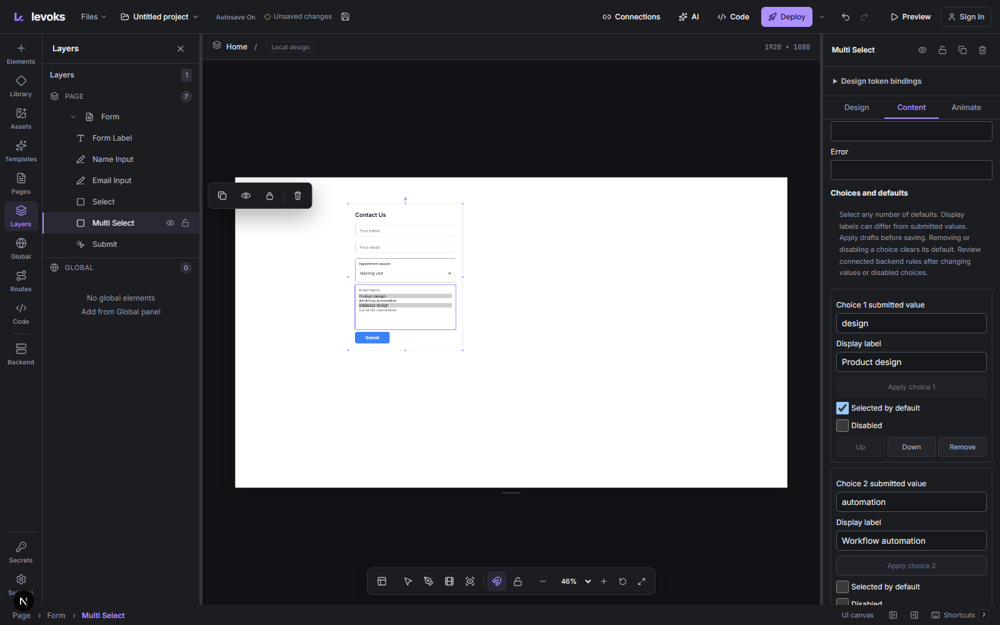
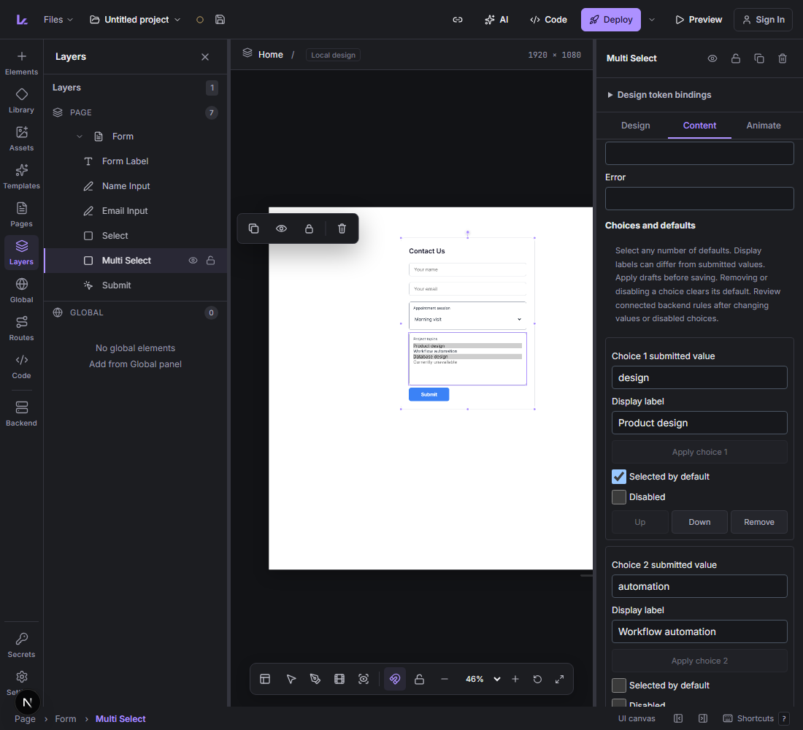

UX11/UX24/SEM05 remain PARTIAL. Optgroups, conditional forms, multi-checkbox composites, reusable-component structure, general nested geometry, complete site starters and whole-catalog screen-reader/touch acceptance remain. Point 4 continues; points 5–6 retain their documented work. See [select contracts](fullstack-contracts.md#visual-select-choices-and-defaults).

## Visual radio-group authoring — 2026-10-10

Form Content can add Radio Group, and native group Content now edits the question, shared field name, Required, labels, distinct submitted values, disabled choices and a single default. Add/Apply/Remove/Up/Down use ordinary native radio children and existing history. Invalid names, collisions, duplicate/blank/multiline values, oversized labels, locked choices and linked component structure fail without partial document changes. Empty unconnected groups expose Add. Copied authored groups get independent names. A mapped choice can be removed using another enabled child as its source while preserving the backend field identity; removing its last enabled source requires disconnecting or remapping first.

Visible questions render as native fieldset legends. Required applies to inputs, rather than an invalid fieldset attribute. Groups without an explicitly authored height grow around their choices while retaining their minimum; new choice rows grow for wrapped labels. The existing generated form serializer and allowed-value/Required server rules execute the submitted values. Backend schemas/rules remain creation-time snapshots and need review after changes.

Acceptance: 148 unit tests pass, TypeScript passes and lint has zero errors (49 existing warnings). Eight distinct browser cases cover two real drag/drop group workflows plus existing broader forms, guided destinations and attachments. The main group journey verifies differing labels/values, duplicate/name recovery, defaults, disabling, keyboard reorder/focus, removal of the mapped source, undo/redo, completed save/reload, preview and exact real ZIP parity. A direct tray group verifies growth/containment in both canvas and generated preview. Initial harness assertions compared zoomed physical pixels to CSS height and attempted to click an intentionally disabled collection action; corrected assertions measure unscaled layout and check the disabled action/visible warning. Both group journeys were rerun successfully. Desktop/compact screenshots use existing inspector tokens and were reviewed.

All 39 downloaded files match the final compiler and refreshed production fixture. Generated Next and Express builds pass. Actual production Next/Express/MongoDB execution verifies native Required, arrow navigation past disabled choices, storage of values rather than labels through the repaired mapping, seven forged/wrong-type/disabled submissions without writes, native reset/defaults, optional omission, outage/restart/retry and reload. Form/group containment, sibling non-overlap and wrapped-label bounds pass at 320/768/1024/1440px. Editor production build, after-build typecheck and private-output packaging checks pass.

Evidence under `.verification/`: `radio-unit-final.log`, `radio-check-last.log`, `radio-browser-final.log`, `radio-browser-last.log`, `radio-refresh-final.log`, `radio-front-build-final.log`, `radio-back-build-final.log`, `radio-runtime-final.log`, `radio-editor-build-last.log`, `radio-typecheck-final.log`, `radio-packaging-final.log` and `radio-parity-final.log`. Required empty/all-disabled groups also fail guided creation before any backend mutation, verified by unit and final browser recovery checks. Reproduce the group authoring/export/runtime path with `npm run test:radio-export`. All execution remains local.

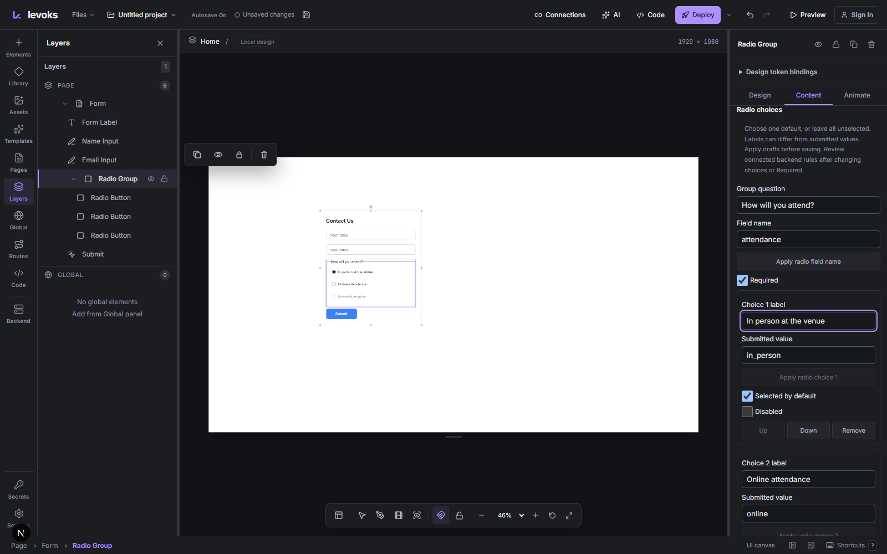
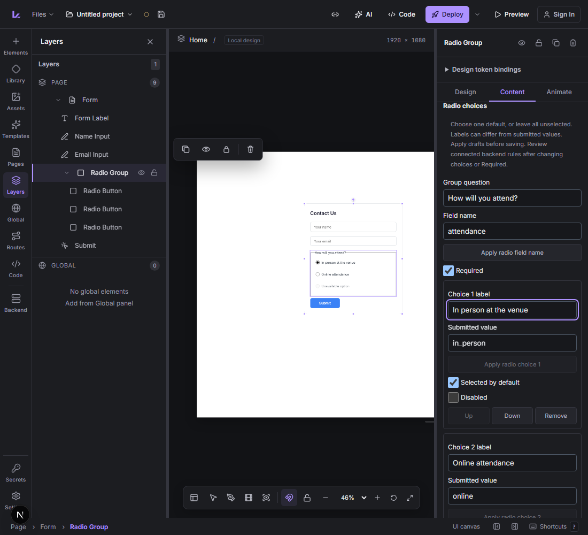

UX11/UX24/SEM05 remain PARTIAL. [Radio-group contracts](fullstack-contracts.md#visual-radio-group-authoring) limit the composite editor to direct native radio children. Mixed/nested content, reusable-component structural overrides, conditional forms, multi-choice checkbox composites, select label/value separation, general nested geometry, complete site starters and catalog-wide accessibility acceptance remain. Point 4 continues; points 5–6 retain their documented internal/provider work.

## Submission attachments — 2026-10-09

Native File Upload now authors a size limit and comma-separated extensions, with inline configuration errors. Guided collections support one enabled attachment field and one file, up to 256 KiB. Creation snapshots an ordinary editable Submission attachment validation rule and an object/body mapping. Required remains separate; optional empty file inputs are omitted. Strict shared validation checks filename, canonical encoded bytes, exact size and extension before saving bytes atomically with the submission. Successful reset clears selection; read/request failures preserve it for retry.

Private inboxes download validated attachments as neutral binary Blobs with the submitted filename. Attachment collections use five-record pages; other inboxes retain 50. Anonymous/revoked/non-operator sessions cannot read the stored bytes, and sign out clears visible records. Corrupt stored attachments show an unavailable state. No filesystem paths, separate upload endpoint, cloud bucket or new storage lifecycle is introduced.

Acceptance: 146 unit tests pass, TypeScript passes and lint has zero errors (49 existing warnings). Seven browser journeys cover real drag/drop attachment authoring, invalid-limit/extension recovery, undo/redo, backend rule edits, completed save/reload, frontend preview, actual ZIP/compiler parity and existing nested forms/destinations/inboxes. All 70 downloaded source files match the final compiler and refreshed build fixture; generated frontend and both Express services build. The actual production Next/Express/MongoDB app verifies native Required, client limits, ten malformed API payloads without writes, exact binary persistence/download, restart/retry/reset, five-record pagination, corrupt/soft-deleted records, live role denial/recovery and sign out. Form containment/non-overlap and inbox page bounds pass at 320/768/1024/1440px; mobile keyboard downloads remain reachable inside the local table scroll region. Editor production build, after-build typecheck and private-output packaging checks pass. Screenshots were reviewed.

Evidence under `.verification/`: `attachment-check-final.log`, `attachment-browser-final.log`, `attachment-refresh-final.log`, `attachment-front-build-final.log`, `attachment-back-build-final.log`, `attachment-identity-build-final.log`, `attachment-runtime-final.log`, `attachment-editor-build-final.log`, `attachment-typecheck-final.log`, `attachment-packaging-final.log` and `attachment-parity-final.log`. Reproduce with `npm run test:attachments-export`. Initial browser helper selectors and single-click tray insertion were corrected; the full affected suite was rerun. The compiler's fixed inbox-size contract was updated to validate five-record attachment pages while preserving the ordinary 50-record contract. All execution remains local.

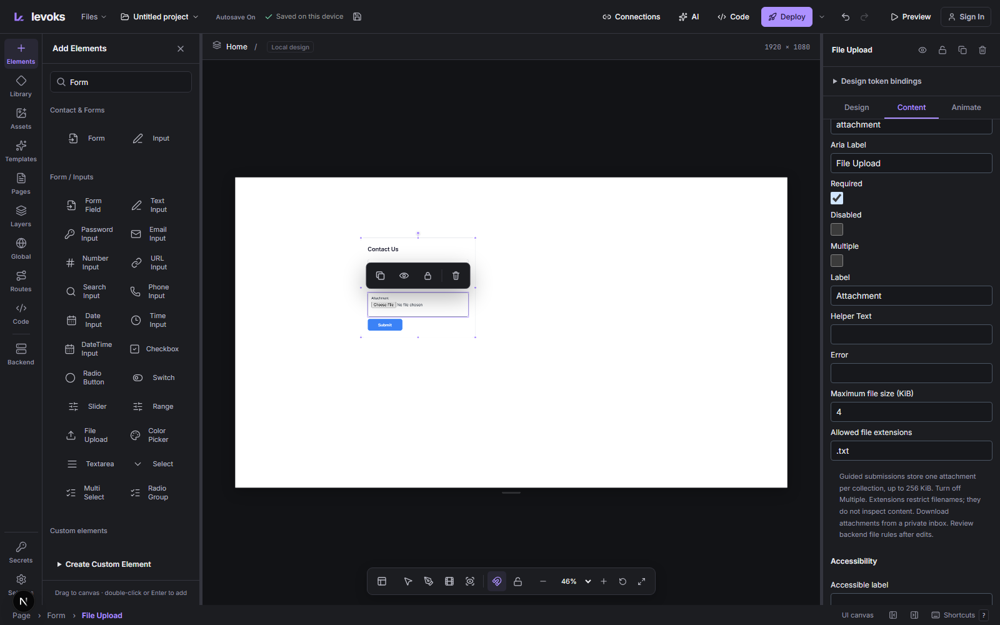
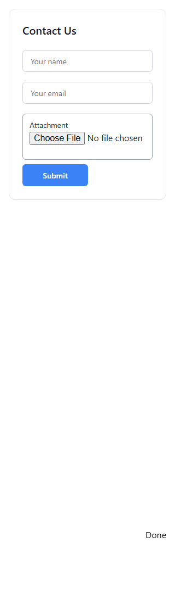
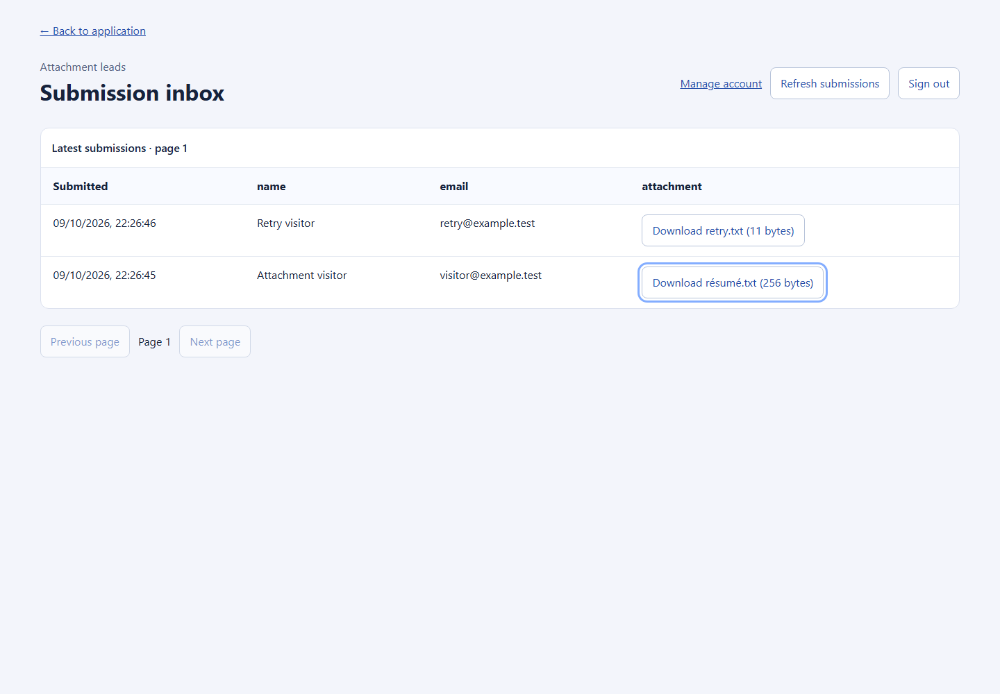
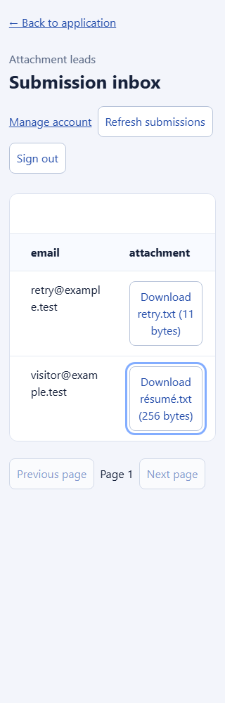

BE39/BE40 and UX11/UX24/SEM05 remain PARTIAL. [Attachment contracts](fullstack-contracts.md#submission-attachments) retain the one-file limit, JSON/storage bounds and filename-only extension checks. General storage/upload/download blocks, larger/multiple files, content inspection, hosted assets, quotas/retention, SQL/provider acceptance, conditional/composite controls, component geometry, full site starters and whole-catalog accessibility remain. Point 4 continues; points 5–6 retain their documented work.

## Visual select choices and defaults — 2026-10-09

Native Select and Multiple Select now expose labelled choice rows, Add, Apply rename, Up/Down, Remove and default checkboxes. Single Select permits one default or a placeholder; Multiple Select permits several. Rename/removal updates choices and defaults atomically, reorder retains selections, and native buttons restore focus after structural edits. Blank/duplicate/multiline/oversized visual edits fail without mutating project state. Empty lists show an Add path. The existing newline contracts remain unchanged; native disclosure controls retain bulk lists and imported-state repair. Users apply rename drafts before saving and review connected backend rules after choice changes.

Acceptance: 144 unit tests pass, TypeScript passes and lint has zero errors (49 existing warnings; scoped final lint has no warnings). The expanded real drag/drop workshop browser journey verifies visual construction of single/multiple choices, invalid rename recovery, default retention, remove/reorder focus, undo/redo, desktop/compact containment, completed save/reload, preview and actual ZIP parity. Three existing guided-form browser cases also pass. The latest downloaded Next/Express/MongoDB app builds and executes: authored defaults, typed string/array storage, forged-selection/consent/text/temporal rejection without writes, public quota, outage/retry/reset/reload and non-overlapping form bounds at 320/768/1024/1440px. All 39 downloaded files match the final compiler and built fixture. The final editor production build, after-build typecheck and private trace/standalone packaging assertion pass. Screenshot review replaced initially unstyled new buttons with existing editor tokens and restored visible row borders.

Evidence under `.verification/`: `options-unit.log`, `options-check-fixed.log`, `options-browser-final.log`, `options-refresh-final.log`, `options-frontend-build-final.log`, `options-backend-build-final.log`, `options-runtime-final.log`, `options-archive-parity-final.log`, `options-compiler-parity-final.log`, `options-editor-build-final.log`, `options-typecheck-final.log`, `options-packaging-final.log` and `options-lint-final.log`. Reproduce the end-to-end downloaded application with `npm run test:form-controls-export`. Initial helper-name/type errors were repaired; the complete affected authoring path was rerun. All execution remains local.

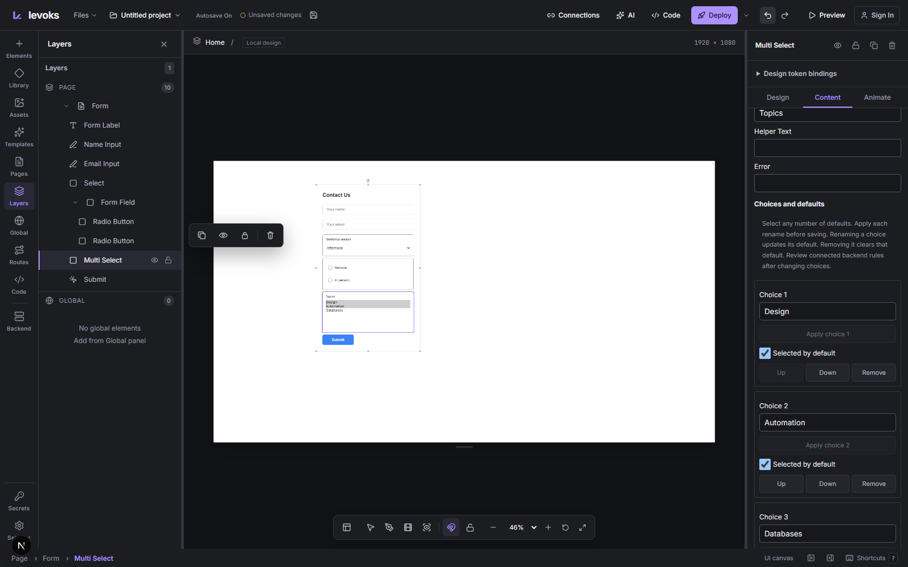
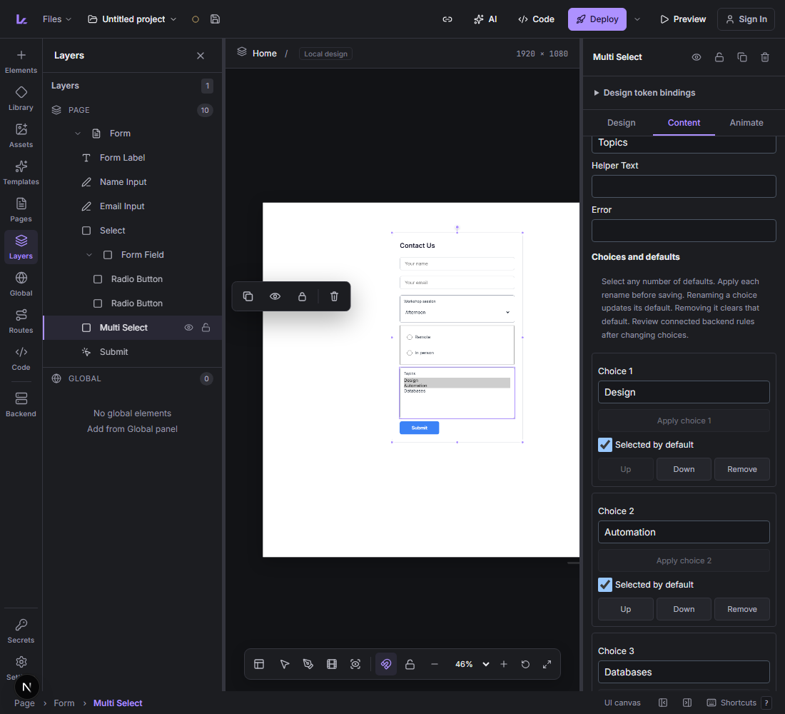

UX11/UX24/SEM05 remain PARTIAL. This accepts the existing Select/Multiple Select choice/default editing contract. [Contracts](fullstack-contracts.md#visual-select-choices-and-defaults) retain separate labels/values, optgroups, disabled individual options, radio/composite/conditional editors and backend snapshot limits. Uploads, advanced/custom validation, component/geometry work, full site starters and catalog-wide accessibility/responsive acceptance remain. Point 4 is still in progress; points 5–6 retain their documented work.

## Text formats, lengths and URL validation — 2026-10-09

Content now exposes bounded minimum/maximum lengths for text-like native/legacy inputs and Textarea, preserving unset values and zero. Native inputs offer five no-code text formats, including Unicode letters/numbers. New guided destinations copy ordinary editable Text and Absolute URL rules into the backend; unsupported custom patterns and invalid limits fail before creating services. Rules retain separate Required semantics, optional blank omission and creation-time snapshots. Existing destinations require rule review after field edits.

The real drag/drop workshop journey verifies inline invalid-limit recovery, rule/message editing, undo/redo, completed save/reload, preview and actual ZIP download. This revealed native properties being saved as numbers although their definitions require strings; controls now persist canonical strings. Production execution also exposed permissive browser URL parsing accepting a malformed hostname that Node rejects. The shared serializer now checks parsed special-scheme hostnames for forbidden characters, preserving malformed input and showing an error before POST. The browser test executes the actual client validator in Chromium instead of injecting Node's URL implementation.

Acceptance: 143 unit tests pass, TypeScript passes and lint has zero errors (49 existing warnings). Eight browser cases cover the new authoring journey, 45 native text-format comparisons, 18 URL cases executed against both browser client and server validators, 51 temporal comparisons and existing login/form-destination/nested-layer regressions. The actual downloaded production Next/Express/MongoDB app rejects short, overlong, malformed and wrong-type text/URL inputs without writes, retains the public 20-request quota, stores valid inputs, omits blank optional fields, preserves input through outage/retry and restores defaults on reset/reload. Form bounds and sibling non-overlap pass at 320/768/1024/1440px. Editor and generated production builds pass; all 39 downloaded files match both final compiler output and the built fixture. Production trace/standalone exclusions pass.

Evidence under `.verification/`: `text-check-corrected.log`, `text-browser-corrected.log`, `text-parity-final.log`, `text-regression-corrected.log`, `text-refresh-corrected.log`, `text-frontend-build-corrected.log`, `text-backend-build-corrected.log`, `text-runtime-final.log`, `text-archive-parity-final.log`, `text-compiler-parity-final.log`, `text-editor-build-corrected.log`, `text-typecheck-corrected.log` and `text-packaging-corrected.log`. Reproduce the downloaded runtime through `npm run test:form-controls-export`; browser format/parser checks use `npx playwright test tests/e2e/text-validation.spec.ts`. All execution remains local.

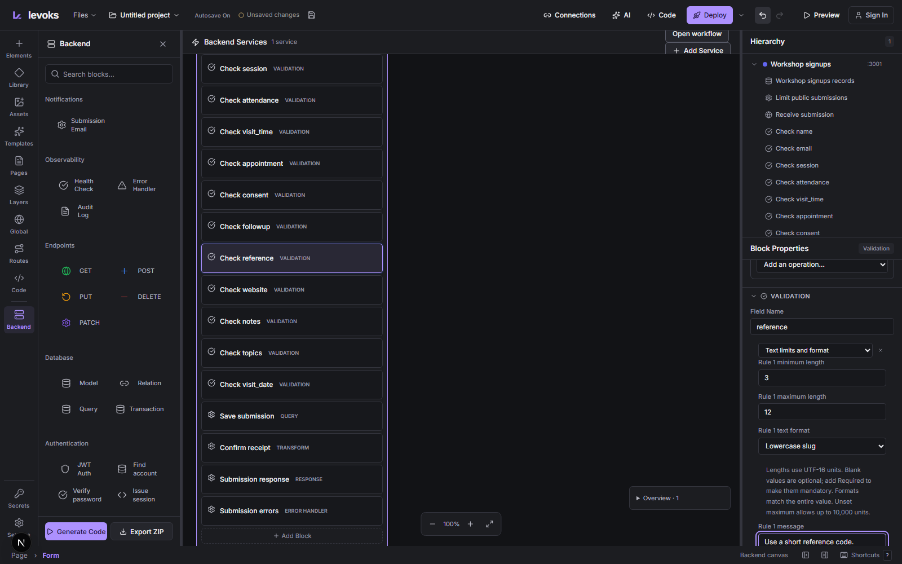
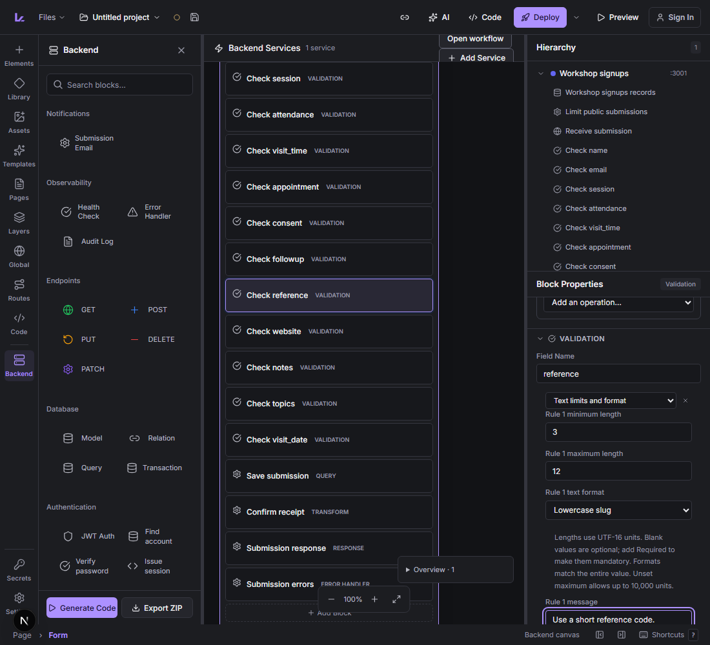
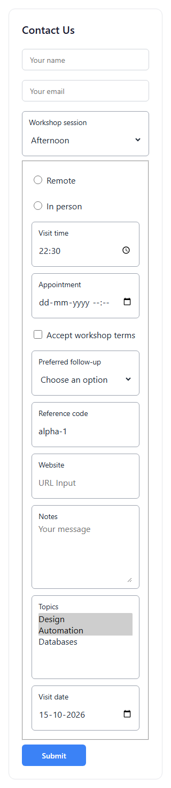

UX11/UX24/RT02/SEM05 remain PARTIAL. [Text contracts](fullstack-contracts.md#text-formats-lengths-and-url-validation) record length caps, fixed formats, URL syntax-only behavior and snapshot boundaries. Advanced/custom validation, file storage, conditional/composite controls, reusable-component structural edits, general nested geometry, full site starters and catalog-wide accessibility/responsive acceptance remain. Point 4 remains in progress; points 5–6 retain their documented internal/provider work.

## Date/time limits and server validation — 2026-10-09

Native Date/Time/DateTime authoring now exposes minimum, maximum and step, with native pickers, units/help and inline configuration errors. New guided destinations snapshot ordinary editable Date/Time/Local date and time rules: strict calendar/local-time formats, inclusive ranges, midnight-spanning time ranges and native minimum/initial-value/default step bases. Blank optional fields are omitted; required contracts remain separate. Local strings retain their timezone-free storage representation. Invalid configurations fail before collection creation and at the saved-project/compiler boundary. Existing destinations are not silently rewritten after form edits.

Acceptance: 141 unit tests pass with TypeScript and zero lint errors (49 existing warnings). Two browser cases verify real drag/drop authoring, limits/error/undo/save/reload/preview/download parity and 51 native Chromium/server comparisons. Five existing backend-login/form-destination/nested-editing browser cases pass. The actual downloaded Next/Express/MongoDB app verifies browser blocking, seven temporal API rejections without writes, valid local-string storage, optional omission, failure/retry/reset and non-overlapping form bounds at 320/768/1024/1440px. Editor and generated production builds, all 39 downloaded-source/fixture comparisons and private-output packaging checks pass.

Evidence: `.verification/temporal-check.log`, `temporal-browser.log`, `temporal-regression.log`, `temporal-refresh.log`, `temporal-frontend-build.log`, `temporal-backend-build.log`, `temporal-runtime.log`, `temporal-archive-parity.log`, `temporal-editor-build.log`, `temporal-typecheck-final.log`, `temporal-final-tests.log` and `temporal-lint-final.log`. The reproducible export/runtime path remains `npm run test:form-controls-export`; native parity is `npx playwright test tests/e2e/temporal-validation.spec.ts`.

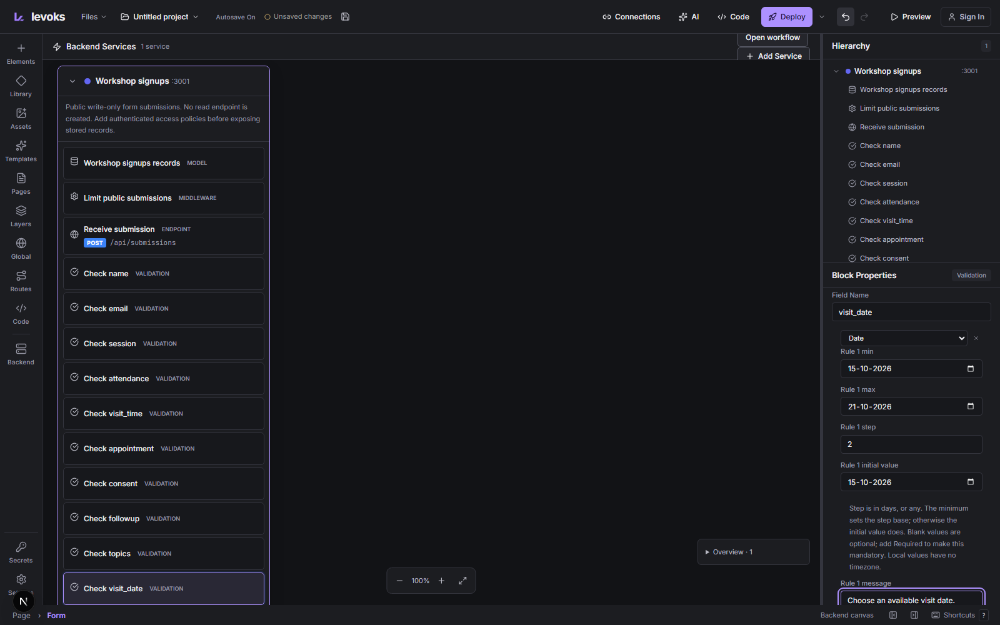
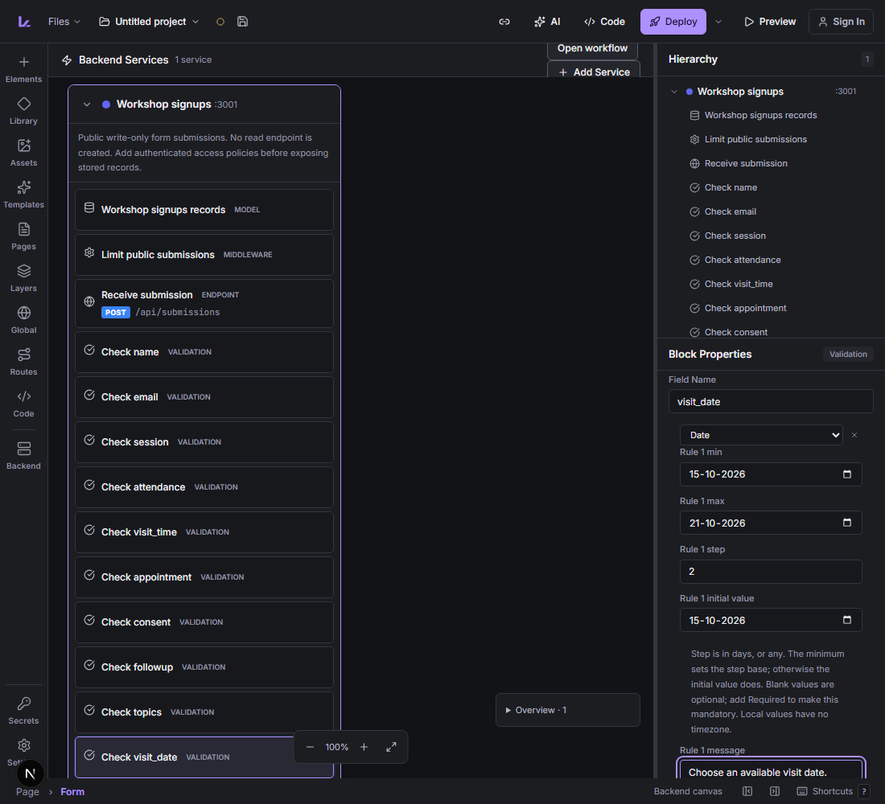
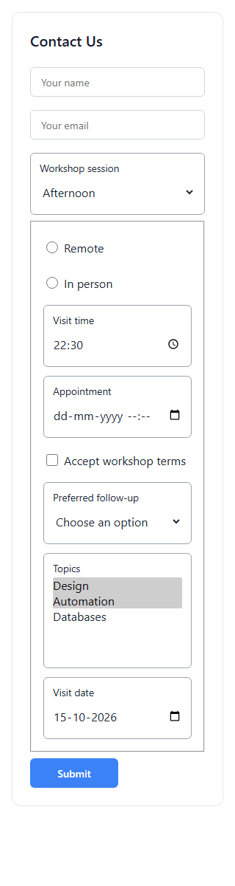

UX11/UX24/RT02/SEM05 remain PARTIAL. [Temporal contracts](fullstack-contracts.md#date-and-time-validation) record arithmetic/interval bounds and snapshot semantics. Pattern/URL/text constraint authoring, uploads, conditional/composite controls, reusable-component structural edits, general nested geometry, full site starters and catalog-wide accessibility/responsive acceptance remain. Other browsers, screen readers and mobile picker interaction are not certified by Chromium. Point 4 remains in progress; points 5–6 retain their internal/provider acceptance work.

## Server choice/consent rules and editable validation — 2026-10-09

New guided destinations snapshot native Select/Multiple Select and enabled radio-group values into ordinary Allowed values rules. The server rejects unlisted strings, duplicate selections and mixed/wrong-type selections. Required Checkbox/Switch creates Must be checked, requiring literal boolean `true` independently of generic Required (which still accepts zero/false). Optional single-select placeholders are omitted and optional arrays may be empty. Existing destinations/rules are not silently rewritten after field edits; the form inspector explains where to review them.

Backend Validation now exposes allowed values, existing length/range rule values, messages and removal with accessible names. Invalid choice lists show an inline error and fail project validation; lists support at most 200 unique values and 10,000 characters. One shared emitted helper covers explicit workflows and legacy middleware, retaining their existing coercion and partial-PATCH behavior. The actual authoring journey creates nested controls, recovers from duplicate choices with undo, edits rule parameters/messages, verifies history/save/reload/preview and downloads compiler-equivalent output. Desktop/compact review repaired truncated choice lists and cramped type/message controls with the existing multiline style and separate rows.

The downloaded production Next/Express/MongoDB application rejects forged radio/select values, unlisted/duplicate/mixed array selections and false/string/missing consent with 400 responses and no writes. Valid consent is stored as a boolean; an untouched optional choice is absent, a selected optional choice is stored, and success/reset/reload restore authored defaults. A required unchecked checkbox sends no request. Backend outage/restart preserves values and consent before retry. Controls retain containment and sibling non-overlap at 320/768/1024/1440px. Reproduce with `npm run test:form-controls-export`.

Evidence under `.verification/`: `form-constraints-unit.log` (ten focused choice/Required/program regressions), `form-constraints-check-final.log` (138 unit tests, TypeScript, lint zero errors/49 existing warnings), `form-constraints-regression.log` (five login/form-destination/nested-layer cases), `form-constraints-ui-final.log` (final authoring/error/layout/ZIP journey), `form-constraints-ui-lint-final.log` (zero errors/seven existing scoped warnings), `form-constraints-editor-build-final.log`, `form-constraints-typecheck-final.log` and `form-constraints-packaging.log` (production build/typecheck/trace exclusions). Final downloaded source and unchanged dependency manifests are checked in `form-constraints-refresh-final.log` and `form-constraints-archive-parity.log`; `form-constraints-front-build-final.log` and `form-constraints-back-build-final.log` validate the frontend and 13 backend modules, and `form-constraints-runtime-final.log` verifies actual production requests/storage/layout. Generated installs report zero vulnerabilities. Inspector and production screenshots were inspected. All execution remains local.

An older Required-only regression initially exercised the new choice rule too. Its fixture now isolates Required, retaining the original zero/false assertions; separate emitted-middleware checks reject forged choices and consent. Generic test block configs needed explicit ValidationConfig narrowing. The final UI/runtime reruns retain error, history, persistence, recovery and geometry assertions.

UX11/UX24/RT02/SEM05 remain PARTIAL. This accepts bounded choice/consent enforcement and editable rule parameters. Date/time format/range/step rules, pattern/URL and broader text constraint authoring, conditional/composite editors, file storage, reusable-component structural edits, general nested geometry, complete site starters and catalog-wide accessibility/responsive acceptance remain. [Contracts](fullstack-contracts.md#choice-and-consent-validation) retain snapshot and Error Handler boundaries. Point 4 remains in progress; points 5–6 retain their documented work.

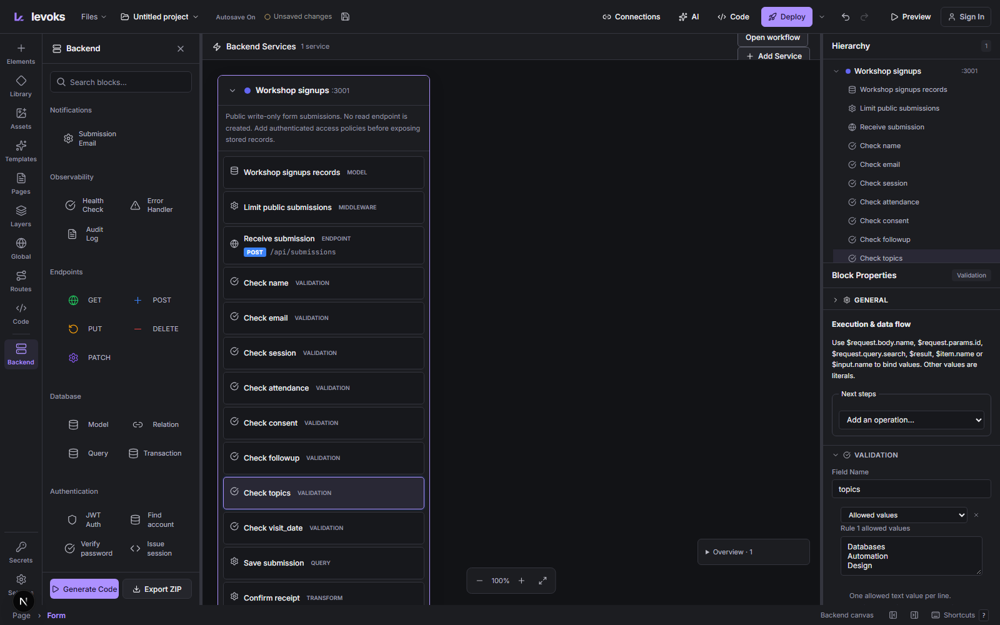

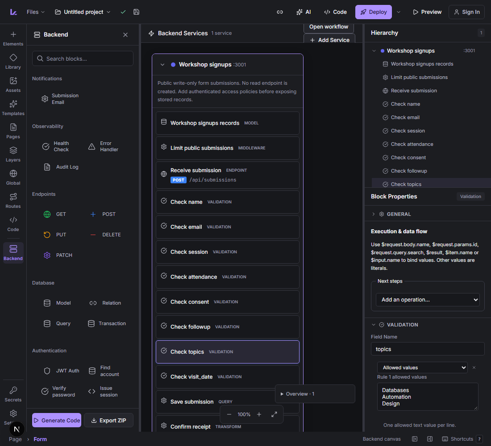

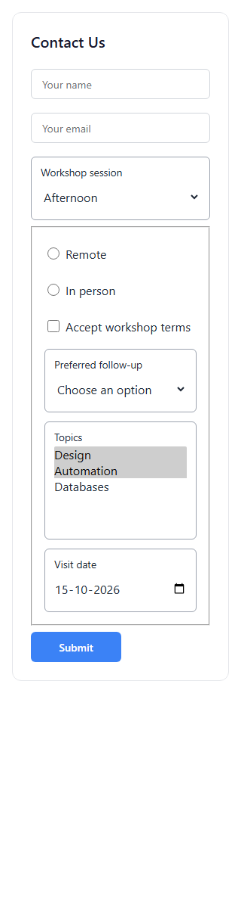

## Existing-control moves and native Layers ownership — 2026-10-09

Form → Content → Fields now moves existing controls/groups into the form or a descendant group through one keyboard-operable native selector. Cancel preserves the parent; Apply/Cancel return focus to the originating Move button. Layers accepts native fieldsets and maintains one owning page/global tree when children are detached or reparented. Rejected moves explain locked ancestors or the need to detach linked component instances; after detaching, the same move succeeds. Shared checks reject cycles, nested forms, cross-scope/inactive-page moves and excessive depth. Form moves retain field identities and same-form backend/routing mappings, and place the moved node in normal flow at base and every saved responsive override while preserving authored widths and content.

The actual workshop form journey regroups a date field by keyboard and multiple-select by Layers, checks cancel/focus/undo/redo, saves/reloads, exercises generated preview and downloads an equivalent ZIP. The downloaded production Next/Express/MongoDB application verifies the regrouped controls through typed submissions, validation, backend outage/restart, preserved input, reset and reload. Nested controls fit without overlap at 320/768/1024/1440px. A separate actual Layers journey verifies global-root detach/reparent, locked-group rejection, linked-child/target rejection, detach recovery, save/reload, preview and ZIP parity. Its downloaded production frontend keeps the global child unique and correctly nested on two routes and the detached component child in its saved page group.

Evidence under `.verification/`: `nested-editing-check-final.log` (136 unit tests, TypeScript, lint zero errors/49 existing warnings), `nested-editing-unit-final.log` (three focused tree/history/depth regressions), `nested-editing-regression.log` (ten combined design/form/Layers cases), `nested-forms-authoring-final.log` (final chooser focus/cancel and desktop/compact containment), `nested-editing-editor-build.log` (production build/private-data pruning), `nested-editing-packaging.log` (all traces/standalone exclusions), and `nested-editing-typecheck-final.log` (after-build typecheck). Actual downloaded build/runtime evidence: `nested-forms-front-build-final.log`, `nested-forms-back-build-final.log`, `nested-forms-runtime-final.log`, `nested-forms-latest-archive.log`, `nested-global-build.log` and `nested-global-runtime.log`. The two export scripts reproduce the supported paths: `npm run test:form-controls-export` and `npm run test:nested-editing-export`.

The first global-root edge drop exposed an insertion marker shifting hit-test rows during drag. Markers now render inside their row without changing geometry; the original detach assertion passes. Final repeated authoring creates fresh backend identities, so the last downloaded form is independently extracted, built and executed rather than reusing an earlier fixture. No behavioral assertion was removed. Desktop/compact move choosers, Layers and production screenshots were inspected. Testing stays local.

UX09/UX11/UX24/SEM05 remain PARTIAL. This accepts same-form control regrouping and native/global tree ownership. Reusable-component structural overrides, arbitrary absolute/rotated-parent geometry, richer server field constraints, file storage, conditional/composite editors, complete site starters and library-wide responsive/accessibility acceptance remain. Existing model/contracts are not migrated automatically; moving fields between different forms requires reviewing destinations. [Contracts](fullstack-contracts.md#native-and-nested-form-controls) retain these limits. Point 4 remains in progress; points 5–6 retain their documented work.

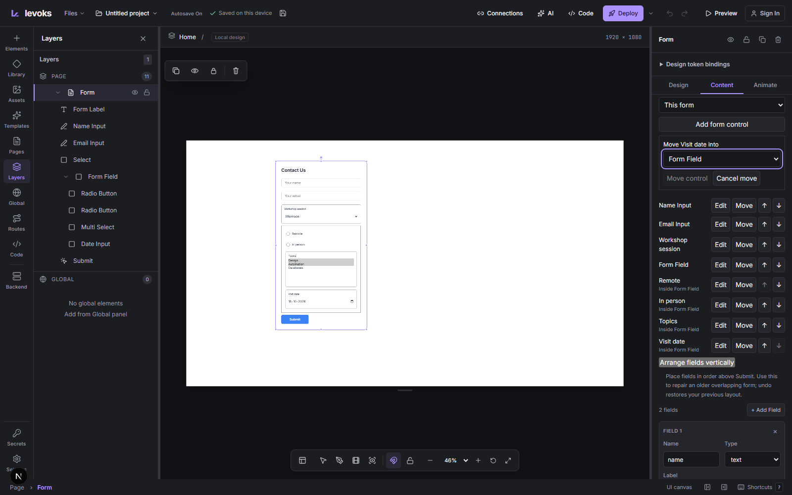

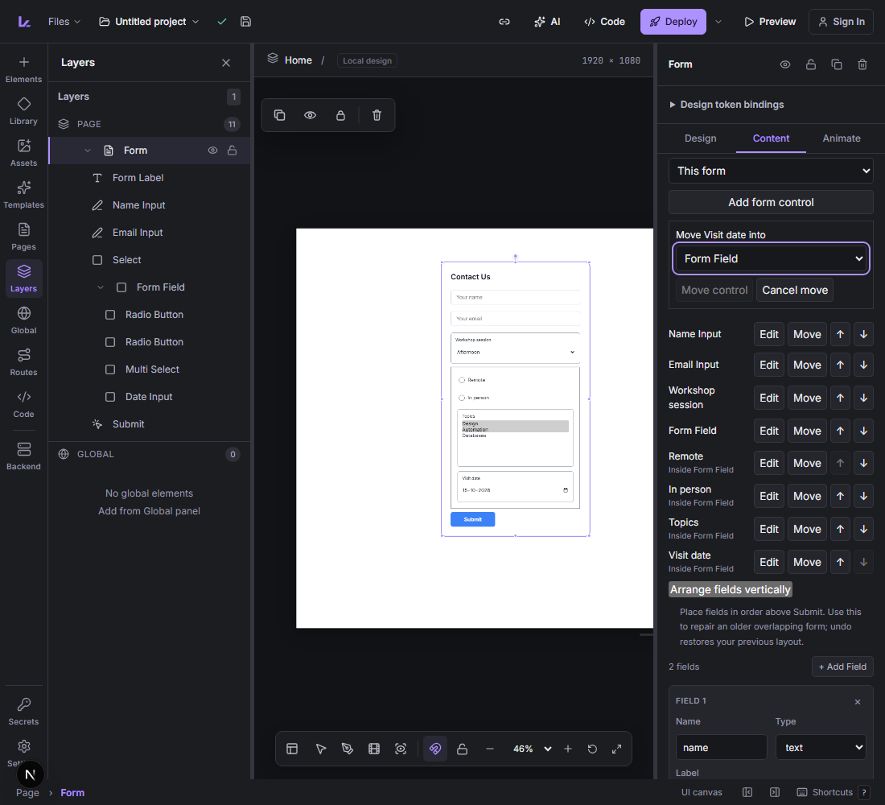

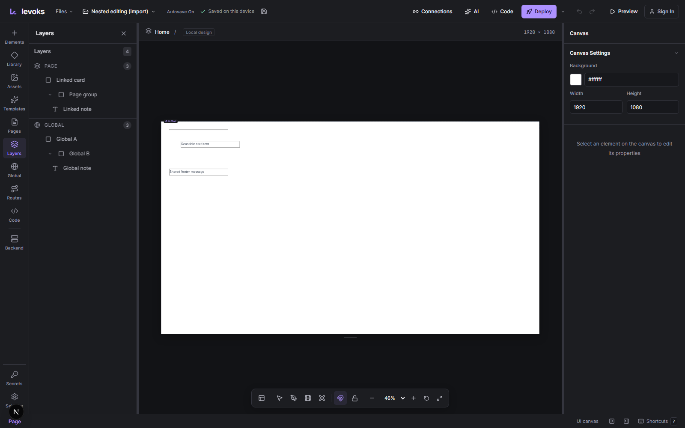

## Broader native forms and nested field authoring — 2026-10-09

Form → Content → Fields now adds native controls to the form or an existing nested group, selects any native/legacy field (including disabled descendants), and orders controls within their parent through shared undo/redo. Fields and groups insert before Submit. Multiple Select persists initial selections in the shared canvas/HTML/React semantic tree. Guided storage treats same-name radio members as one stable string field and multiple selections as a body array; the destination inspector and compiler use the same compatibility rule. Required multiple selections create an ordinary Required Validation block, which also rejects empty arrays on the server. Generic API array presence/type semantics are preserved. Numeric zero and checkbox false remain typed values; disabled fieldset descendants are omitted from requests.

The actual authoring journey drags a Form, adds session/topics/date controls and nested attendance radios, reorders with undo/redo, creates a storage destination, saves/reloads, exercises generated frontend preview and downloads the application. Every file equals current compilation. The actual downloaded production Next/Express/MongoDB app stores the chosen radio and selected arrays, rejects missing/wrong-type/empty-required values without writing records, supports radio arrow-key selection, preserves input through a backend outage, retries after restart, resets to authored defaults only on success and retains stored records after reload. Controls fit their form and viewport with no sibling overlaps at 320/768/1024/1440px. Editor controls fit a 1100px compact window. Desktop/mobile production and desktop/compact inspector screenshots were inspected.

Evidence under `.verification/`: `form-controls-check.log` (133 unit tests, TypeScript, lint zero errors/50 existing warnings), `form-controls-unit.log` (final focused assertions, including ordinary legacy validation rules), `form-controls-browser.log` (12 combined authoring/form/functional-property/live-data regressions), `form-controls-authoring-final.log` (added compact layout/screenshot acceptance), `form-controls-export-final.log` (complete `npm run test:form-controls-export`: actual download/extraction, frontend production build, 13 backend modules checked, real production runtime), `form-controls-editor-build.log` (editor production build and private-data pruning), and `form-controls-preview-build.log` (production traces/standalone packaging). Generated installs reported zero vulnerabilities. All testing stayed local, with no publication, remote Git writes or paid providers.

The initial unmapped serializer lost values supplied by FormData in an existing regression fixture. Retaining native FormData and applying typed native overrides fixes the cause; the original assertions pass. Final review repaired a disabled radio mapping source blocking another enabled selected member; the final downloaded runtime explicitly verifies that case. Test typechecks exposed the schema's wider parsed animation type; tests now use the typed authoring store for native-tree assertions. One parallel typecheck raced the production build replacing `.next/types`; the final checks ran after build completion. No behavioral assertion was removed to obtain a pass.

UX09/UX11/UX24/RT02/SEM05 remain PARTIAL for the wider requirements. This accepts the tested nested native form path. File uploads/storage, richer server option/date/checkbox constraints, conditional forms, composite option editors, cross-parent movement, nested reusable component overrides, complete site starters and library-wide responsive/screen-reader/touch acceptance remain. Existing models/contracts are not silently migrated after field edits. Date/time fields currently store native strings. See [native form contracts](fullstack-contracts.md#native-and-nested-form-controls). Point 4 is in progress; points 5–6 retain their documented internal and external work.

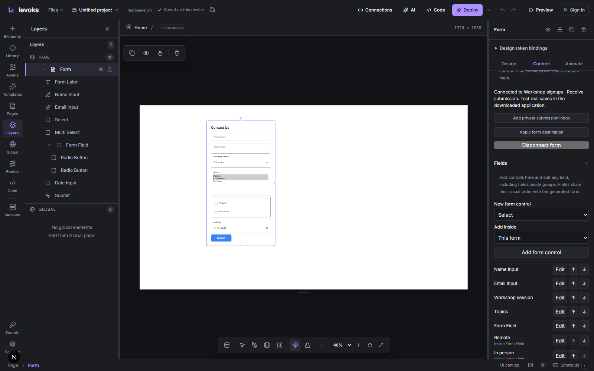

## Live database tables, collections and repeaters — 2026-10-09

Content now offers **Live records** on Tables, Collections and Repeaters. Existing compatible GET list endpoints provide records; nested Text/Title/Paragraph fields use stable model-field identities. Table columns support selection, headings, removal and ordering. Empty text, source changes and child-field disconnects persist through shared history, project reload, validated IR and the actual downloaded application. Collection adds one native display definition; the earlier 104-definition census remains historical, while the current registry has 105 definitions.

Generated widgets render real paginated records with loading, empty, 401/403, safe error, retry and refresh states. Each source keeps its own page. Gateway writes and focus/visibility events refresh the lists; inactive views discard records and obsolete requests are aborted. Existing backend permissions remain authoritative, including operator-only submission endpoints. Field values render as text, including `0`/`false`; object/string display is bounded. Repeated DOM IDs are scoped by record. Tables contain overflow, collections use their authored grid and live widget height grows with content instead of overlapping adjacent mobile roots.

Acceptance includes actual Table drag/drop, inspector configuration, atomic disconnect/undo, nested field selection, save/reload and an every-file comparison between the browser ZIP and compiler. Native Next/Express/MongoDB preview exercises public and private records, independent pages, outage/retry, HTML safety, regular-account denial and revoked-session denial. The actual downloaded production application exercises empty/typed records, desktop grid/mobile bounds, malformed envelopes, duplicate IDs, excessive pages, real backend outage and durable records after restart. `npm run test:live-data-export` reproduces the browser/download/build/runtime journey. Evidence is in `.verification/live-data-check-final.log`, `live-data-regression.log`, `live-data-export-final.log`, `live-data-editor-build.log`, `live-data-packaging.log` and `live-data-preview-production.log`.

Final checks pass: 131 unit tests, TypeScript, lint (zero errors/50 existing warnings), nine combined browser regressions, the two final live-data browser/runtime journeys, the downloaded production runtime, three production-editor preview cases and production build/packaging. A further browser case verifies orphaned-field repair, undo and save/reload (`live-data-orphan-recovery.log`); final ZIP/compiler equivalence is recorded in `live-data-final-export-parity.log`. Compiler regressions reject inherited/missing field identities, nested static repeaters and conflicting routing response targets. These additions preserve valid generated files.

Screenshot review exposed fixed sample heights spilling live content over adjacent mobile widgets and cramped column controls. Both were repaired and the export/runtime journey rerun with layout and unique-ID assertions. Build acceptance also found Next's Windows exclusion matching retaining preview artifacts despite configured globs. A final `postbuild` cleanup now removes private trace references and disposable standalone copies, preserving original runtime/test data; the existing all-trace/standalone assertion passes. Initial production test failures used native Response status as a method and the wrong generated server filename; the corrected harness retains its runtime assertions.

UX21/SEM05/IR01/IR05 remain PARTIAL for their broader contracts. This accepts direct bounded read/display lists, not arbitrary request/response mappings, search/sort/filter authoring, record actions, images/links, nested live scopes, subscriptions, SQL runtime acceptance or whole-library accessibility. Unsupported sources/scopes and deleted fields block executable export. Generated frontend-only preview sends no backend requests. [Contracts and usage](fullstack-contracts.md#live-database-widgets) describe the exact limits. Next in the six-point sequence: broader forms, nested editing and responsive polish. All execution remains local.

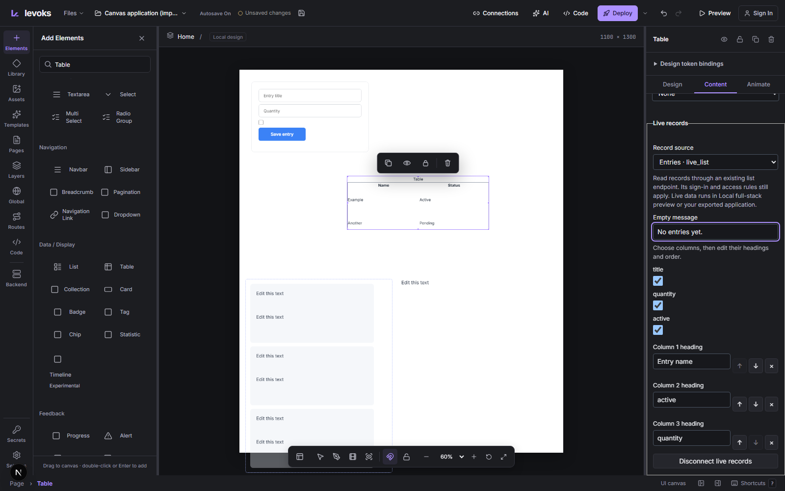

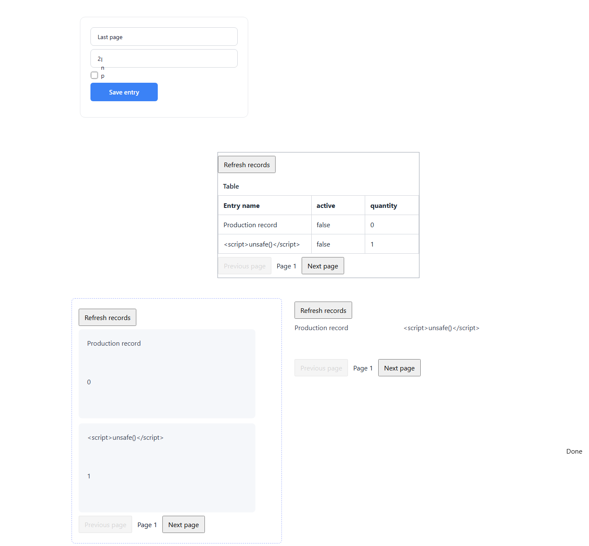

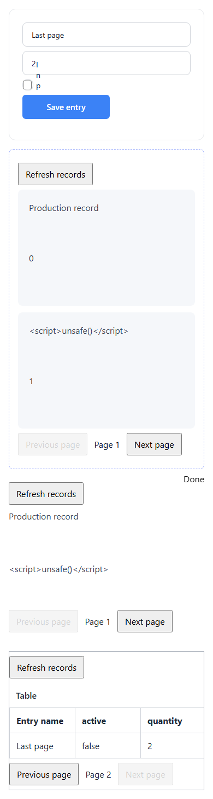

## Local full-stack editor preview — 2026-10-09

Preview now offers **Local full-stack** beside the generated frontend and design simulation modes. Start compiles current definitions and runs the actual Next/Express application, disposable MongoDB replica set, account/inbox pages and supported email workers. Native form submissions save records; emails are captured by a loopback receiver. Reload preserves records and the current generated route. Rebuild gets new ports, credentials, accounts and records. Stop and leaving preview stop the services and remove their run directory.

Management is limited to the configured loopback editor origin, same-origin mutations and an HttpOnly owner capability. Another browser cannot read or stop a run. Runtime environment inheritance is restricted; custom definitions/source, custom middleware, environment blocks, HTTP Request blocks and non-MongoDB adapters fail before host execution. This is separation for compiler-generated applications, not an arbitrary-code OS sandbox. Limits are eight services, two concurrent runs, 30 minutes and 50 captured emails. SQL, custom-source container sandboxing, hosted previews and production-runtime parity keep UX04/SB01 PARTIAL.

Verification: `.verification/fullstack-preview-final-check.log` records 129 passing unit tests. `fullstack-preview-typecheck.log` and `fullstack-preview-lint.log` pass with zero errors and 50 existing lint warnings. `fullstack-preview-combined.log` records all nine browser cases passing together: three native preview workflows and six canvas/form/inbox/alert regressions. They cover actual drag/drop, persistence/export parity, authenticated inbox access, owner/origin denial, iframe parent isolation, captured worker mail, routing/reload, rebuild isolation, cancellation and port/directory cleanup. `fullstack-preview-integration.log` records 18 serial integrations passing and three external SQL cases skipped. `fullstack-preview-audit.json` reports zero production advisories. Desktop/mobile screenshots below were visually inspected.

Initial browser execution exposed a shortcut that retained an old iframe document after in-app navigation, cold pages accepting submit before hydration, and reload using the previous route during navigation. Forced shortcut remounts, a page-level readiness/location bridge and a disabled Reload until readiness repair these behaviors. Test-only selectors were corrected without weakening runtime assertions. One export comparison ran while its compiler was being edited; the complete unchanged-source rerun passes.

Production build verification found Turbopack hashing excluded temporary files before applying tracing filters, failing on live MongoDB locks. The editor build now uses Next's supported Webpack builder and excludes preview/verification artifacts. `fullstack-preview-build-webpack-locked.log` records a successful build while a fixture file was exclusively locked for the entire build. `fullstack-preview-packaging.log` checks every emitted trace and the actual standalone tree for both private directories; the check passes and can be rerun with `npx tsx --test tests/generated/preview-build.test.ts` after building.

`fullstack-preview-production-browser.log` records all three preview journeys passing against the built editor, separately from the nine-case development run. `npm run test:preview` preserves this build/packaging/production-browser verification path. The generated preview application itself still uses a development Next server; this does not close production-runtime parity. The first production harness attempt used a configuration-relative working directory and could not find its launcher; correcting its working directory allowed the full run to pass.

No external provider, publication, paid inference or remote repository writes were used. The next implementation at this increment was live database binding, recorded in the later entry above.

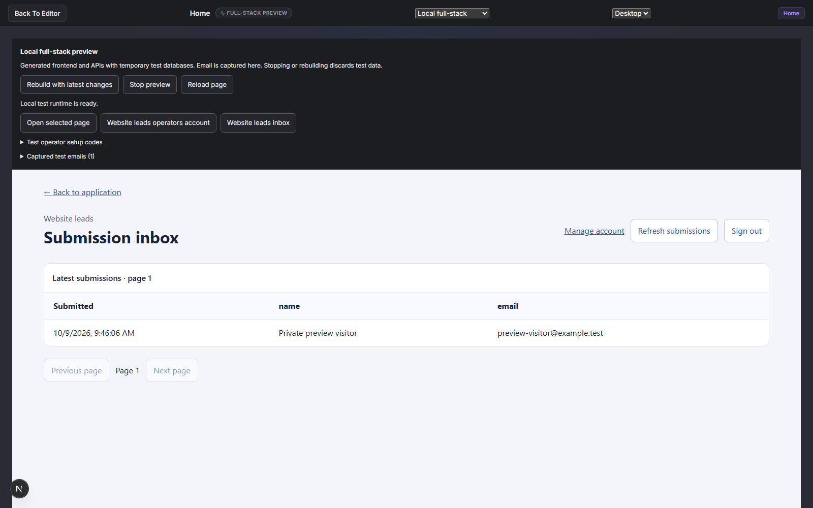

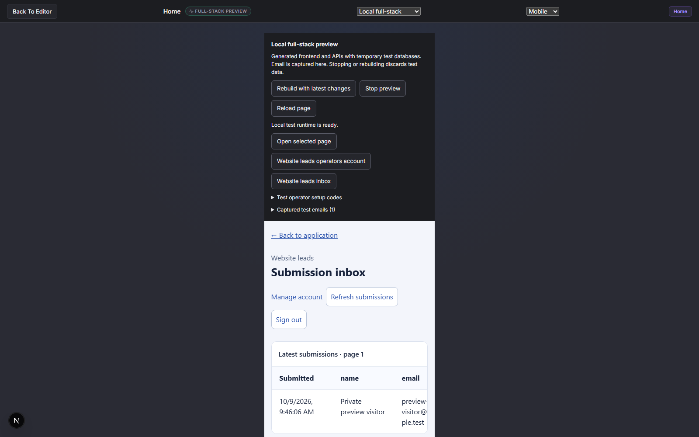

## Durable submission email alerts — 2026-10-09

Connected MongoDB forms with a private inbox offer **Email alerts for new submissions** and an editable subject. This adds one ordinary Submission Email configuration block; its endpoint/query/model/inbox bindings are editable in Backend. Enable/disable, undo/redo, save/reload and downloaded IR preserve the configuration. Invalid bindings, SQL/relationships, duplicate queues, reserved internal fields and provider settings in project blocks prevent executable export.

The generated create query saves the record and hidden queued alert in one MongoDB document write. Validation failures create no alert; the API makes no provider requests. Disabled configurations stop new jobs while existing jobs drain. Public receipts and authenticated inbox responses omit queue metadata. Messages contain a generic notice and the authenticated inbox link, without submitted names, addresses or message contents.

A separately supervised worker uses atomic 60-second leases, a 15-second HTTP timeout, stable idempotency keys, bounded retries/backoff and safe classification of 429/5xx/transient-409 versus permanent rejection. Crash-after-acceptance replay uses the same payload/key. A salted fingerprint rejects changed sender/recipient/origin settings on already attempted jobs. Five attempts and a 23-hour lifetime stay within the provider's documented [24-hour idempotency window](https://resend.com/changelog/idempotency-keys). Expiry/cancellation preserve records; soft-deleted unleased submissions cancel queued alerts. Sent records mean provider acceptance, not mailbox delivery.

Runtime sender/recipient/origin/provider keys live in `notifications/.env` or the worker process environment. The API loads its own `.env`. Compose workers use an optional notifications profile, no published ports and no JWT/setup tokens. Blank worker variables do not block starting APIs. Generated Docker ignore rules exclude nested environment files; actual container execution remains a later gate. `notifications:status` reports only counts. The root ZIP includes NOTIFICATIONS.md with setup, retries and operating limits.

Verification: `.verification/notifications-check.log` (127 unit tests, TypeScript/lint with 0 errors/50 existing warnings), `notifications-export.log` (actual drag/drop → form/inbox/alerts → history → save/reload → inspector editing → ZIP → fresh extraction → generated frontend/two backend builds → three real browser/Express/MongoDB/worker cases), `notifications-regression.log` (seven editor cases, including every ZIP file compared with current compilation), `notifications-integration.log` (18 serial integrations passed, three external SQL cases skipped) and `notifications-editor-build.log` (editor production build). The runtime covers unavailable/missing provider configuration, concurrent workers, 503/429/transient-409 retry, crash/restart replay, permanent rejection, retry exhaustion, expiry, soft deletion, changed settings, authenticated inbox access and hidden operational data. Email HTTP transport is replaced only by a loopback receiver. No external delivery, publishing or paid usage occurs.

Initial verification found an overbroad status selector and select labels that included option text. The test selector was narrowed; the product select controls now have explicit accessible labels and use the existing padded inspector layout. No runtime assertion or retry delay was weakened; fixtures advance persisted dates to exercise retry/expiry without waiting hours.

BE25–27/BE36 remain PARTIAL: this is a specific submission outbox, not general editable queues/jobs/events, scheduler execution, queue administration/replay, arbitrary email templates/attachments, multi-recipient/channel preferences, delivery webhooks/bounces, visitor confirmation, SQL/relational support or live-provider acceptance. The next business-site increment is broader form controls, then a complete site starter and wider operator/team administration.

## Private submission inbox and first operator — 2026-10-09

The next business-site increment is implemented: connected forms offer **Add private submission inbox**. One undoable action creates a separate MongoDB identity service, an operator role and read permission, an authenticated paginated query and a generated inbox. Definitions persist through save/reload/IR/ZIP. Backend endpoint settings expose the generated view; incompatible edits block compilation. Public submission POSTs remain unauthenticated even when the service has a private read policy; authentication is inferred from reachable scoped queries rather than unrelated service policies.

The generated account page provides **Set up first operator** and links to its connected inboxes after sign-in. Enrollment requires an exact allowed origin and a runtime-only random 64-character hex code, hashes passwords, and grants the operator role without accepting an authored role. A hidden unique sparse MongoDB marker and startup index initialization permit exactly one initial operator across concurrent processes and restarts. Public registration always creates a regular user. Setup codes cannot be stored in Environment Variable blocks. The same JWT_SECRET is required by identity and resource services; Compose forwards the setup code only to the selected identity service. Remove it after enrollment. SUBMISSIONS.md explains setup and limits.

The inbox shows escaped model fields and timestamps, 50 records per page, loading/empty/error/retry states and mobile horizontal scrolling. Reads require a live revocable operator session and return no-store responses. Rows clear during loading, failures and sign-out; focus/visibility changes revalidate access. Ordinary users, revoked sessions, disabled accounts and invalid tokens cannot read records. Current database roles govern access even when a token contains an older role.

Evidence: `.verification/inbox-check-complete.log` (123 unit tests, TypeScript and lint); `inbox-regression.log` (six editor browser cases covering new inbox, existing form destinations/templates/mappings, routing and login); `inbox-export-complete.log` (actual drag/drop setup, history/save/reload/ZIP, fresh extraction, generated frontend and both backend builds, two production browser/runtime cases); `inbox-integration-final.log` (18 real integrations passed, three external SQL cases skipped, serial execution); `inbox-editor-build.log` (editor production build). Runtime acceptance covers wrong/missing setup configuration and origin, eight concurrent enrollment requests across two processes with one success, restart uniqueness, real public saves, normal-account role injection denial, pagination and soft-deleted empty pages, escaped HTML, mobile bounds, outages/retry, live role changes, logout and disabled accounts. All runs are local; generated package installs report zero vulnerabilities.

Initial failures: a browser alert selector also matched Next's route announcer, and the test resource service lacked its required JWT_SECRET; both test setup issues were corrected. A parallel health integration exceeded its 150-ms dependency deadline; the unmodified suite passes serially. Verification extraction now clears only a checked child directory of .verification so deleted routes from an earlier ZIP cannot survive into a later build.

UX11/UX24/BE09/BE13–15/RT02 remain PARTIAL for their wider requirements. This delivers one initial operator and a built-in submission reader, not team/tenant administration, operator replacement, arbitrary collection/table binding, rich search/export/editing, SQL guided setup, notifications, uploads or isolated full-stack preview. Operators read all records in the connected submission service. An exactly full last page may offer one empty next page because total counts are omitted.

## Guided form storage and working contact starter — 2026-10-09

UX09/UX11/UX24/RT02/IR05 now include Form → Content → Submission destination. The wizard creates an ordinary editable MongoDB model, public POST endpoint, validation, bounded create workflow and routing mappings; it can instead map existing POST/PUT/PATCH contracts. Creation and additive template insertion are single history entries across UI/backend/routing. Same-endpoint updates preserve response and failure settings; failed creation rolls back definitions. New services have distinct database fallbacks. Authoring field changes does not silently migrate existing stored records.

Templates → Add working contact form preserves existing content and adds a name/email form plus connected storage. Confirmation/reset settings persist and execute only after successful requests; errors retain values and disabled fieldsets are omitted. No public read/edit route or submitted-data echo is generated. Optional private inbox/first-operator setup was added in the later increment above; broader operator administration, uploads/multiple-selection wizard support, general notifications, whole-site starters, broader nested layouts and isolated full-stack preview remain open. The default IP limiter is process-local and shared by visitors behind the same gateway; counters reset on service restart. These rows remain PARTIAL.

Evidence: `.verification/form-destination-check-complete.log` (120 unit tests, TypeScript, lint 0 errors/50 existing warnings); `form-destination-unit-final.log` (three focused tests including multi-service database isolation and failed cross-page creation rollback); `form-destination-export-final.log` (three real browser authoring cases, actual ZIP extraction, generated frontend/backend builds and production Next/Express/MongoDB browser execution); `form-destination-regression-final.log` (seven form/mobile/page-metadata/routing cases); `form-destination-integration.log` (18 passed, three external SQL cases skipped); `form-destination-build.log` (editor production build). Runtime acceptance includes required/malformed/overlong values, failed save/retry/native reset, managed/unknown-field exclusion, public GET/PUT/PATCH/DELETE denial, 429 exhaustion, stored records after restart and mobile bounds. Generated package installs report zero vulnerabilities. All testing is local.

Initial test failures were test-side: export was attempted with preview still open, and a layer selector used a nonexistent class. Both journeys pass with the real controls. An initial generated test typecheck used `status()` on native Fetch responses; lint also caught an unescaped apostrophe. Both were corrected. A parallel regression launch collided with the integration Next dev server's build-directory lock; integration completed and the sequential browser rerun passed. No product behavior assertion was removed to obtain a pass.

## Response metadata and bodyless statuses — 2026-10-09

BE03 now includes editable application response headers on Response workflow blocks, persisted through IR and generated JSON. Values support string/number/boolean literals and public data bindings. Compiler and runtime checks enforce names, case-insensitive uniqueness, printable ASCII and 32-header/4-KB-value/8-KB-total limits. Transport, caching, identity, correlation and security headers cannot be overridden; direct credential/secret bindings fail compilation. Login restrictions also apply to header bindings, and resolved values are validated before session issuance. The gateway discovers allowed names through the endpoint's reachable workflow, including nested branches, and forwards only those bounded names. Header-to-view mappings, dynamic transport/security headers and richer error/status-specific schemas remain open; BE03 is still PARTIAL.

Explicit 204/205/304 responses now discard the value and send no body. A reachable 204/205 with declared response-body fields fails compilation. Real Express GET/HEAD routes and the gateway preserve these statuses/headers, and the generated API client treats 205 as successful empty output. Built-in identity lifecycle and inferred CRUD controllers retain their existing contracts.

Evidence: `.verification/response-headers-check.log` (117 unit tests; TypeScript; lint 0 errors/50 existing warnings), `response-headers-review.log` (six focused final review checks), `response-headers-browser.log` (invalid/repair, empty-name and incomplete-binding recovery, add/undo/redo, save/reload and actual browser ZIP), `response-headers-runtime.log` (real generated Express/gateway status/value checks), `response-headers-integration.log` (18 passed, three external SQL cases skipped), `response-headers-downloaded-final.log` (production build and actual downloaded Next/Express/Mongo login metadata, exposed versus unexposed cross-origin headers, cookies and existing invalid/recovery journey), and `response-headers-build.log` (editor production build). An initial TypeScript failure was confined to a test assigning a generic service to a parsed semantic document; the fixture now goes through parseProject and the combined check passes. Earlier evidence remains below. All execution was local.

## Header contracts, CORS and backend labels — 2026-10-09

BE03/RT02 now include scalar application request-header contracts, persisted identities and Routing mappings. The generated client keeps headers separate from request bodies; the gateway forwards only headers declared by the matched endpoint. Validation rejects missing/malformed/repeated raw fields, control characters and excessive values. Workflows receive only declared normalized metadata, and undeclared header bindings fail compilation. Browser/transport/authentication headers are reserved; metadata cannot establish owner/tenant identity. Built-in account forms do not acquire arbitrary extra metadata fields: required lifecycle metadata needs a mapped canvas form or compatible client. Rich response/error/status contracts remain open.

BE46 now exposes editable origins, methods, automatic/custom allowed headers (including an empty custom list), exposed headers, credentials and preflight caching. Generated code uses the installed cors package plus a small fail-closed guard. Runtime origins are validated/normalized for existing identity checks. Wrong browser origins/methods/preflight headers are denied; no-Origin server clients keep their existing authorization requirements. Wildcard/regex origins and broader middleware scope remain unsupported; public health probes retain their separate boundary. Shared direct backend controls now have associated labels, and sections announce expanded state. Full editor accessibility acceptance is still open.

Final shared-handler review also fixed disabled/aria-disabled wired actions, including link-shaped buttons. Those targets exit before changing busy state or calling an API. The executed-handler and semantic regressions pass in `.verification/disabled-actions-final.log`; the combined check and downloaded application were regenerated afterward.

Evidence: `.verification/product-plan-combined-check.log` (115 unit tests, TypeScript, lint 0 errors/50 existing warnings), `cors-final-integration.log` (17 passed; three external SQL tests skipped without URLs), `cors-headers-browser-recheck.log` (header/CORS edit, invalid feedback, history, save/reload and actual ZIP), `cors-headers-downloaded-runtime.log` (production build and real Next/Express/Mongo browser execution of that ZIP), and `product-plan-combined-build.log` (editor production build). The generated browser checks required-header rejection before session issuance, real cross-origin fetch/preflights, denied credentialed cross-origin reads, hidden unexposed headers, login and HttpOnly cookies. Earlier backend-login/readiness/relationship browser cases passed in `cors-headers-browser-final.log`; that run's header case failed because the fixture added a second CORS block. It was corrected to edit the existing block and the focused case then passed. The first generated login run had a stale generic-message assertion, updated to the authored safe `Invalid credentials` message. Real HTTP CORS coverage lives in the integration suite so a clean `npm run check` does not depend on ignored runtime-install artifacts.

## Relations and publish readiness — 2026-10-08

BE06 now executes the MongoDB resource subset through inspector → undo/redo → persistence → validated IR → downloaded ZIP → actual Express/replica-set execution. The inspector supports one-to-one, one-to-many and many-to-many with an explicit junction, creates reference fields in one undo entry, exposes owner/tenant scope matching and explains Restrict/Cascade/Unlink. Generated writes use a shared database lock and transactions, enforce active parent references, reserve one-to-one/junction uniqueness and bound cascade execution. Tests cover cross-owner/tenant links, two concurrent server processes, restart, restore/purge, failed cascades and an error caught inside an explicit transaction without committing partial changes. Standalone MongoDB fails startup with a safe actionable message. SQL/cross-service/self relations, automatic populated reads, migrations and production load/container acceptance remain open.

UX05 now includes an actionable publish-readiness checklist. Compiler errors select their actual backend/routing/page location; unwired forms/buttons, missing local links, missing page descriptions and runtime setup requirements have review targets. Compiler blockers still gate export; advisory findings do not falsely certify runtime readiness or block valid exports. Browser acceptance repairs a relation, form destination, button link and SEO setting, saves/reloads and downloads. A second browser case checks 1,000 elements while rendering 20 checks initially. Existing saved redirect buttons now use safe native links in canvas/HTML/React; an exported production website verifies Enter-key navigation.

Evidence: `.verification/product-plan-final-check.log` (110 unit tests, typecheck, lint), `product-plan-browser-final.log` (four browser cases), `product-plan-final-integration.log` (16 passed; three external SQL tests skipped without URLs), `relations-downloaded-final.log` (two real runtime cases, including actual downloaded files), `product-plan-design-runtime.log` (generated production build/browser runtime) and `product-plan-final-build.log` (editor production build). [Implementation progress](product-implementation-progress.md) keeps the earlier repair evidence separate. Historical census totals below remain unreconciled; these rows stay PARTIAL.

## Product completion direction — 2026-10-02

The user has explicitly prioritized completing the documented product, not launching a reduced scope. [Product completion plan](product-completion-plan.md) defines the implementation order and acceptance gates. The older 125-row totals below are historical; later contracts and integration implementations were not consistently reflected in the baseline rows. Current row descriptions now acknowledge those implemented subsets without declaring them complete.

Fresh baseline: TypeScript and lint pass with existing warnings; all 88 unit tests pass (`.verification/launch-baseline-check.log`). The cloud persistence increment below adds coverage and fixes without declaring the whole product complete.

### Cloud save ownership and concurrency

- Expected cloud revisions now belong to an account and browser tab, persist across that tab's reload, and advance only after successful save/restore. Shared legacy localStorage revisions are not adopted. Existing cloud projects must be opened once in a new tab. A stale tab cannot borrow another tab's revision to overwrite newer cloud work.
- Save requests carry the expected account identity; the server compares it with the authenticated session and rejects a changed account before mutation. Cloud lists are hidden when the UI's signed-in account changes; restores check the returned owner.
- Real Next.js HTTP acceptance exposed that this installed NextURL normalizes `127.0.0.1` to `localhost`. Shared JSON request validation now compares Origin with the actual HTTP Host and request protocol, retaining port/scheme checks and ignoring forwarded-host overrides. This fixes valid loopback requests without treating different loopback origins as equivalent.
- The new MongoDB/HTTP test uses real NextAuth session decoding with locally signed test sessions, the actual Next route and a disposable database. Eight competing creates and eight competing updates each produce exactly one success; stale writes, cross-account reads/updates, invalid projects, unauthenticated writes and foreign origins are rejected. This is not live OAuth-provider or hosted database acceptance.
- The Chromium regression uses controlled cloud/session responses to exercise two actual tabs, preserved unsaved input on conflict, account switching and a cookie/UI account mismatch. The screenshot `cloud-save-conflict.png` was inspected; no layout change was needed.

Evidence in `.verification/`: `product-completion-check.log` (TypeScript, lint and 89 unit tests passed), `product-cloud-runtime.log` (actual Next/MongoDB test passed), `product-cloud-browser.log` (Chromium regression passed), `product-cloud-ui-detect.json` (no findings), `product-completion-build.log` (editor production build passed). PS01–02 remain PARTIAL for broader recovery/synchronization and live sign-in/hosted acceptance.

### Typed defaults and resource soft deletion

Model defaults now have inspector controls, typed validation, persisted configuration and generated Mongoose values, including `0`, `false`, empty strings, JSON collections, dates and ObjectIds. Model field names/types have their own readable inspector row. Inferred CRUD honors defaults and soft deletion; explicit Query workflows add deleted-record selection, restore and purge. Policies constrain lifecycle operations, unresolved mutation filters are rejected, and restore/purge both roll back inside transactions.

Evidence in `.verification/`: `model-lifecycle-check.log` (TypeScript/lint and all 91 unit tests pass), `model-lifecycle-all-integration.log` (all 13 integration tests pass, including real MongoDB/Express lifecycle, identity, aggregation and real Next cloud persistence), `model-lifecycle-browser.log` (lifecycle save/reload/download and existing login browser tests pass), `model-lifecycle-build.log` (production build passes). The existing aggregation browser regression also passed before the inspector layout adjustment. Desktop/compact screenshots were reviewed in two bounded passes. `model-lifecycle-ui-detect.json` reports 11 pre-existing global CSS findings, none in changed declarations; Inter is explicitly retained by DESIGN.md. See [backend compiler](backend-compiler.md#model-defaults-and-record-lifecycle) for semantics and boundaries. These resource behaviors do not implement identity soft deletion, relational actions, retention jobs or migrations.

### Database engine and storage selection — added user requirement

Generated applications now offer MongoDB, PostgreSQL, MySQL, MariaDB and SQLite per service through Settings → Database & storage. Local/self-hosted and remote/managed selections control generated drivers, connections, TLS, setup scripts, readiness and Compose storage. SQLite supports a persistent filename with a runtime path override. Credentials stay in runtime environment variables; Levoks project storage is unchanged. See [database guide](databases.md).

The complete chooser → history → persistence → IR → downloaded application path has browser coverage. Real SQLite, PostgreSQL 17.10, MySQL 8.4.11 and MariaDB 11.4.9 runs cover defaults, aggregates, isolation, lifecycle rollback, uniqueness, schema mismatch and HTTP reads after restart. Existing MongoDB/identity/cloud integration tests still pass. Mixed exports preserve untouched legacy MongoDB volumes. SQL identity controllers, durable audit storage and shared database rate limits are explicitly blocked pending adapters; relations/migrations and managed-provider/container acceptance remain open. This added requirement is outside the historical 125-row census.

Evidence: `.verification/database-check-final.log`, `database-all-integration.log`, `database-postgres.log`, `database-mysql.log`, `database-mariadb.log`, `database-browser-final.log`, `database-build.log`, `database-ui-detect.json` and the two database-settings screenshots. The default integration run skips external SQL engines without their test URLs; the dedicated local server runs provide that additional evidence.

## Functionality and inspector pass — 2026-10-01

The 104 definitions remain unchanged in count. [Per-element browser audit](element-functionality-audit.md) records historical failures, current conservative classifications, the 12 acceptance dimensions and explicit contracts. Registry presence does not establish completion; no element is newly marked fully functional by the census.

| Requirement | Status | Evidence / remaining work |
| --- | --- | --- |
| Inspector → semantic state → IR → renderer/code/export | VERIFIED SUBSET | Store/history remains authoritative. Tabs share CSS; native/Button/Input share a semantic tree. Common style ordering, background conflict handling and explicit dimension reconciliation remove divergent paths. Full property and nested-layout parity for every definition remains open. |
| Tabs screenshot defect | VERIFIED SUBSET | Red fill is visible in browser; border, radius, linked/unlinked padding, font, active/inactive colors, panel text, switching, keyboard and responsive widths survive saved IR and independently built Next export. Nested tab compositions need wider acceptance. |
| Real radio control | VERIFIED SUBSET | Visible editable label, name/value/checked, same-group exclusivity, disabled/required, native label click/Space/arrows and generated runtime. Old tiny controls migrate in semantic state. Browser/assistive-technology breadth remains open. |
| Functional Embed configuration | VERIFIED SUBSET | HTML/Code/URL source, title, invalid-URL feedback, sandbox script/form switches, real isolated canvas iframe, reload/IR and generated runtime. No same-origin capability; provider blocking and full external-provider acceptance remain. |
| Professional numeric parameters | VERIFIED SUBSET | Value drag over a broad horizontal distance, pointer capture, Shift/Alt sensitivity, exact entry, Enter/Escape/arrows, gesture undo/cancel, units and immediate state/canvas updates. Geometry, typography, spacing, border, shadow and animation use the reusable control. Pointer-lock/unlimited travel and broad input-device acceptance are not claimed. |
| Contextual inspector | VERIFIED SUBSET | Color picker/text, typed booleans/enums, linked side/corner spacing, dimensions, typography and animation controls. Dense existing graphite/violet tokens and Lucide icons retained. No design-library or registry expansion. |
| Button/Input/Select | VERIFIED SUBSET | Button label/icon/loading/disabled/link mode; native labeled input with helper/error/constraints; initial Select value agrees across React/HTML output. All variants, actions and multiple selections still need acceptance. |
| Existing editor interaction | VERIFIED SUBSET | Existing browser workflows cover contextual shortcuts, clipboard, group movement/history, pen/motion, layer controls, canvas navigation and responsive settings. Complete shortcut/trackpad/snapping/accessibility acceptance remains open. |
| Whole-library production functionality | PARTIAL | Every element inserted/inspected/edited/reloaded/exported in browser census; all 104 roots rendered in generated preview and production with matching sampled fill. Full behavior contracts remain unverified for many elements; named shells and remaining gaps are explicitly recorded in the audit. |

Verification is reproducible with `npm run check`, the browser specs `element-audit`, `functional-properties`, `design-tools`, `editor-quality`, `semantic-elements`, `canvas-export`, then `scripts/prepare-property-verification.ts`, the resulting frontend production build and `tests/generated/property-runtime.test.ts`. Focused export fixtures come from real browser ZIP downloads. Editor and generated production builds, focused browser/runtime workflows, typecheck/lint and project unit checks pass. This pass does not certify every property or all 104 application behaviors.

## Semantic foundation increment — 2026-09-30

See [audit and implementation contract](semantic-architecture.md) for the architecture map, compatibility decisions, verification and precise limitations. This increment does not mark the entire implementation brief complete.

| ID | Requirement | Status | Evidence / remaining work |
| --- | --- | --- | --- |
| SEM01 | Central element definitions and searchable catalog | IMPLEMENTED SUBSET | 105 definitions, including the later native Collection; defaults, semantic IDs, versions, fields, category metadata, child rules, render/generate strategies; registry-wide round-trip/generation checks. The historical 104-definition census is preserved separately. Legacy renderer/property switches remain adapters. |
| SEM02 | Semantic creation and inspector parity | IMPLEMENTED SUBSET | Native/custom instances retain definitions; drag/drop and typed inspector changes persist and reach ZIP. Native markup shares a semantic tree with canvas. Universal legacy property parity remains. |
| SEM03 | Full application IR | IMPLEMENTED | Validated normalized project plus resolved flows, generator/target versions and used definition/backend strategies; no DOM semantic reconstruction. |
| SEM04 | Geometry, responsive styles and motion | IMPLEMENTED SUBSET | Existing models/compiler preserved; percentage responsive width fix; semantic tests cover geometry, breakpoint styles and keyframes. Arbitrary breakpoints and transformed-layout parity remain. |
| SEM05 | Events and routing | IMPLEMENTED SUBSET | Declared navigation/scroll events, target validation/deletion reconciliation, undo, native button/link routing ports and conflict diagnostics. Browser tests exercise generated navigation. Rich typed data bindings remain. |
| SEM06 | Custom elements and execution boundary | IMPLEMENTED SUBSET | Typed single-module React manifest/source, searchable draggable instances, normal property controls, persistence/history and export imports/dependencies. No source execution in editor. Multi-file imports and isolated custom build/preview remain. |
| SEM07 | Backend registry | IMPLEMENTED SUBSET | Existing 21 block types have validators/defaults/versions/execution strategies and basic typed ports. Existing program generation retained; unsupported variants visibly experimental. |
| SEM08 | Full documented backend category execution | OPEN | Category vocabulary exists. Async, real-time, external integrations, storage and caching are not implemented by adding this registry. |
| SEM09 | Reproducible standalone export | IMPLEMENTED SUBSET | Identical IR produces identical files; sorted ZIP entries/fixed dates; all-definition frontend production build and generated backend module checks passed. Dependency lockfiles still need creation in delivered projects. |
| SEM10 | Compatibility and source ownership | IMPLEMENTED | Additive version 1 fields, lossless legacy definition resolution, future-version rejection, preserved source fingerprints/regeneration boundary and regression coverage. |
| SEM11 | Production-grade frontend breadth | PARTIAL | Native controls/compositions, dialogs/carousels/static tables/media/shapes. 9 experimental definitions and explicit explanations for unimplemented Data Grid/raw HTML/CSS/import workflows. |
| SEM12 | Verification | IMPLEMENTED SUBSET | 73 unit tests, typecheck/lint, 3 Chromium workflows, frontend production export build, generated backend build, desktop/compact screenshot inspection. Live providers/full database acceptance not rerun. |

Sources: `levoks.md` (the user-confirmed conversion of the original PDF), `production-readiness.md`, and the current code. This is an implementation ledger, not a launch declaration. Baseline audit: 2026-09-13.

COMPLETE means UI → persisted state → validated IR → emitted implementation → execution → error handling has evidence where applicable. PARTIAL means some of that chain exists. MISSING means required behavior has no implementation. EXTERNAL DEPENDENCY is reserved for an otherwise implemented, independently verifiable integration awaiting external access; missing internal code never becomes an external blocker. The original audit marked no full product feature COMPLETE. Later entries identify narrowly verified requirements; they do not imply that their containing product area is complete. The original baseline’s 22 tests included substantial mocks and cannot establish full execution coverage.

Evidence shorthand: E = `src/store/editorStore.ts`, `src/components/Canvas.tsx`, `Renderer.tsx`, `PropertyInspector.tsx`; B = `src/types/backend.ts`, `src/components/backend`, `src/lib/codegen/express.ts`; R = `src/store/routingStore.ts`, `src/components/routing`, `src/lib/graphResolver.ts`; W = `src/components/WorkspaceHub.tsx`, `src/store/workspaceStore.ts`; C = `src/lib/project/schema.ts`, `compiler.ts`; T = `tests/`. All paths are relative to the repository.

## Editor structure and interaction requirements

| ID | Specification requirement | Status | Evidence and remaining acceptance criteria |
|---|---|---|---|
| UX01 | Header logo/home navigation, Files menu | PARTIAL | Files menu exposes project creation/opening, rename, import, checkpoint, backup and ZIP through actual workspace actions. The named logo control now opens the project workspace without replacing current edits, with browser acceptance. Full documented hierarchy acceptance remains. |
| UX02 | Header Connections workflow | PARTIAL | Dedicated GitHub Connections with durable credentials, discovery, review and queue; header layout parity and other provider lifecycles remain. |
| UX03 | Small floating AI chat window | PARTIAL | Movable assistant, streaming/proposal review, project/page/selection focus, suggestions and bounded per-project IndexedDB conversation history implemented. Browser checks retain stale-proposal/cancellation safety; live inference and provider accounting still require acceptance. |
| UX04 | Fullscreen play preview | PARTIAL | Generated frontend remains the default opaque-origin mode; Local full-stack runs compiler-generated Next/Express/MongoDB applications, accounts/inboxes and captured email workers with disposable data. Page readiness guards cold-start interaction; navigation/reload, ownership and stop/rebuild have real browser evidence. Custom source, SQL adapters, hosted/container preview and production deployment parity remain. Design simulation is separate. |
| UX05 | Expandable Deploy / ZIP / Commit actions | PARTIAL | Files/Deploy expose project/checkpoint/import/backup, full ZIP and GitHub commit entry points. Publish readiness selects actual compiler blockers, unwired actions/forms, local links and page settings; save/reload/download and 1,000-element browser cases pass. Runtime requirements remain explicit. Full provider deployment depends on the infrastructure ledger. |
| UX06 | Account/profile/settings | PARTIAL | Account menu supports arrow/Home/End/Escape navigation and focus return. Profile uses a named native modal with background interaction blocked, named close control, long-account wrapping and project navigation. Desktop/compact browser acceptance uses controlled session data; real profile management, account lifecycle and preference persistence remain incomplete. |
| UX07 | HDE off-screen visibility toggle | COMPLETE | Header Hide off-screen elements toggles artboard clipping without changing project content. Browser tests verify clipping and its session-only boundary; generated application visibility is unaffected. |
| UX08 | Tray with Elements, Assets, Pages, Backend, Routing, Code, Secrets, Settings | PARTIAL | Labelled rail and contextual panels include Assets, Secrets, Settings and Library. Project raster/font libraries now persist and export; hosted assets and richer account/team settings remain. |
| UX09 | Contextual searchable Sub-Tray; drag/drop and double-click insertion | PARTIAL | Searchable element/backend libraries have empty states, keyboard insertion and close controls. Backend insertion creates an initial service when needed. Full drag/drop catalog coverage remains unverified. |
| UX10 | Pages, per-page layers, globals | PARTIAL | Page/global layer trees, positioned-sibling grouping, ordering and clipboard are implemented. Shared project history now restores pages, their nodes and routing links together across page navigation. Transformed/flow grouping and broad hierarchy acceptance remain. |
| UX11 | Granular property inspector: style/layout/type/borders/fonts | PARTIAL | Tokenized inspector, named fields, collapsible sections, multi-selection alignment/distribution, text editing and context guards. Guided form destinations create database workflows or map existing endpoints; confirmation/reset, history, persistence and actual downloaded saves are verified. Optional private inbox/first-operator setup now persists and executes in downloaded applications. Full property-to-export coverage and broader administration remain. |
| UX12 | Floating Dock: screen device picker, default 1920×1080 | PARTIAL | Floating dock now includes screen presets for desktop/tablet/phone and custom dimensions in Canvas settings. New projects use the specified 1920x1080 default; existing sizes are retained. Brand-specific device catalog and multiple screens remain. |
| UX13 | Pointer/hand/marquee tool cycling | COMPLETE | Single button cycles Select → Hand → Marquee; V/H/M direct selection and temporary Space-pan remain. Browser test verifies each cycle state and existing selection/pan/marquee workflows. |
| UX14 | Zoom-to-cursor, pan, fit, snap | PARTIAL | Shared zoom-to-cursor, wheel/Space/middle-button pan, fit/reset/selection centering across all canvases. UI browser tests cover pan/fit/lock, group movement and undo; all touch, graph wiring and snapping edge cases are not yet accepted. |
| UX15 | Dock lock freezes zoom and movement | PARTIAL | Shared viewport lock now blocks wheel, zoom/fit commands and hand panning, with disabled zoom controls. UI browser regression passes; explicit backend/routing lock and touch coverage remain before marking the whole requirement complete. |
| UX16 | Pen, editable vector curves, closed reusable shapes | PARTIAL | Persisted open/closed Bézier paths support authoring, anchor/handle editing and reusable shapes. Browser draw/edit/save/reuse/reload and exported production SVG pass. Transformed handle and broader vector editing acceptance remain. |
| UX17 | Motion workspace with multiple-object timeline | PARTIAL | Multiple tracks, scrub/play, timing/easing and keyframes persist and generate CSS. Browser multi-track editing/reload passes; exported production browser verifies final transform and reduced motion. Trigger/rotation composition and advanced timeline semantics remain. |
| UX18 | Per-element animations and triggers | PARTIAL | Shared HTML/React animation setup now handles scroll/click/typewriter, cleanup and initial reduced motion. Exported browser checks cover scroll and existing multi-track motion; broad trigger/rotation composition acceptance remains. |
| UX19 | Responsive overrides and breakpoint-specific editing | PARTIAL | Independent desktop/tablet/mobile overrides persist and emit cascading media queries. Browser confirms desktop preservation, reload and generated mobile computed styles. Arbitrary custom breakpoints and transformed hierarchy coverage remain. |
| UX20 | Design tokens and reusable component instances | PARTIAL | Project tokens and linked component definitions/instances now persist, publish, detach, preserve stable IDs/local overrides and support undo. Browser token binding/reuse/reload/generated CSS and unit publication tests pass; nested component/structural override semantics remain bounded. |
| UX21 | Advanced widgets: tabs, repeater, gallery | PARTIAL | Tabs switch distinct panels with keyboard controls; repeaters emit configured copies and can use bounded live records with nested text-field bindings. Native Collection/Table sources have configuration, history/persistence, authorized gateway reads, runtime states, pagination and downloaded production acceptance. Galleries apply columns/gap and icon paths emit SVG. Broader nested editing, record actions, filtering/sorting, arbitrary response shapes and whole-library acceptance remain. |
| UX22 | Asset library: images, icons, fonts | PARTIAL | Project image/font library, WOFF/WOFF2 upload/application, built-in icons, reuse and embedded export implemented. Browser raster upload/delete/reuse/reload/generated image passes. Hosted object storage/CDN and lifecycle permissions remain infrastructure work. |
| UX23 | Full IDE: files, editing, diagnostics, export | PARTIAL | File search/tabs/line gutter, editable source/export, worker syntax/JSON analysis, clickable diagnostics, find/replace and line navigation implemented and browser verified. Full semantic analysis, reconciliation and server runtime remain. |
| UX24 | Undo/redo, keyboard, selection and errors | PARTIAL | Shared bounded undo/redo spans UI, page settings, backend services/blocks and routing. Drag gestures are one entry; cancel restores the full document, project changes clear history, and all canvas modes expose keyboard/header undo. Browser deletion/restoration and generated-source equivalence pass. Saved source/native text history, persisted history beyond checkpoints and broad accessibility acceptance remain. |

## Backend configuration and execution

| ID | Requirement | Status | Evidence and remaining acceptance criteria |
|---|---|---|---|
| BE01 | Logical services, editable containers and ordinary blocks | PARTIAL | Services now open real workflow graphs with saved positions, keyboard ports/movement, ordered execution edges, branch/loop/try-catch paths, cycle errors and deletion cleanup. Unit tests execute emitted branch outcomes; browser connects/drags/reloads. Multi-service topology/orchestration and complete block catalog remain. |
| BE02 | Endpoints: five methods and routes | PARTIAL | Five endpoint methods and routes have inspector configuration; connected operation steps now drive generated runtime execution. Basic CRUD inference remains for endpoints without explicit steps. Comprehensive endpoint contracts and all method/browser combinations need acceptance. |
| BE03 | Endpoint path/query/header/body/response contracts, statuses, errors | PARTIAL | Body/query/path/request-header/response contracts persist stable identities and mappings. Request metadata has scalar validation, per-endpoint forwarding and declared bindings; actual downloaded login enforces headers before session issuance. Response blocks also persist bounded public metadata headers, with per-endpoint gateway allowlists and safe 204/205/304 bodyless behavior. Response bodies/headers are checked before login sessions. Rich error/status-specific schemas, header-to-view mappings and broader lifecycle contracts remain. See fullstack-contracts.md and the 9 October evidence above. |
| BE04 | Models: identity, types, required, uniqueness, defaults, indexes | PARTIAL | Model identity/types and required/unique/index flags emit Mongoose schemas. Typed default editing, error feedback, save/reload and downloaded output are browser-tested; real MongoDB covers every default type, overrides and duplicate-key behavior. Schema/data migration semantics remain. |
| BE05 | Model timestamps and soft-delete behavior | PARTIAL | Resource timestamps, soft deletion, deleted-record reads/aggregates, restore and purge execute. Mongo relations add transactional Restrict/Cascade/Unlink, parent-only restore and dependent purge. Browser ZIP and real HTTP tests cover policy isolation, uniqueness and rollback. Identity soft deletion, retention jobs, migrations and equivalent SQL relational lifecycle remain open. |
| BE06 | Relations, foreign keys, cardinality, update/delete behavior | PARTIAL | Mongo resource relations have persisted inspector configuration, undoable FK creation, validated scopes, one-to-one/one-to-many/explicit junction cardinality, uniqueness and transactional Restrict/Cascade/Unlink. Browser-downloaded runtime passes concurrent two-process races, restart, cross-owner/tenant denial, restore/purge and bounded rollback. SQL/cross-service/self relations, populated reads, migrations and production load acceptance remain. |
| BE07 | Query: model binding, CRUD, count, filter, sort, aggregation, outputs | PARTIAL | Query inspector and validated runtime now support grouped count/sum/average/min/max aggregation as well as scoped CRUD/count/filter/sort. Owner/tenant match precedes grouping; typed filters, sessions, result/time limits and read-only pipelines are enforced. Real Mongo aggregation and transaction tests pass. Joins, arbitrary pipelines and richer result bindings remain unsupported. |
| BE08 | Atomic transaction groups and rollback | PARTIAL | Ordered transaction steps emit session-aware runtime; real replica-set duplicate-write and lifecycle rollback pass. Relation mutations reuse workflow sessions; failed cascades and caught relation errors cannot commit partial deletions. Broader nested error, concurrency/load and browser acceptance remain. |
| BE09 | JWT auth: secure refs, identity/model, expiry, endpoint attachment | PARTIAL | Real generated HTTP verifies login, hashed refresh rotation/replay, logout, password invalidation and cross-service introspection. Generated account UI, email verification/recovery and gateway pass real browser tests with MongoDB/local email transport. One-time setup-code enrollment now creates an operator with durable uniqueness and links to a private submission inbox. Broader administrative lifecycle, alternate strategies and live deployment acceptance remain. |
| BE10 | OAuth auth: providers, callbacks, identity mapping | PARTIAL | Strategy selector exists, generation blocked. Editor OAuth is separate. |
| BE11 | Session authentication | PARTIAL | JWT identity templates now persist sessions and enforce revocation/expiry with inspector controls; separate session strategy selection and full account lifecycle remain incomplete. |
| BE12 | API-key authentication | PARTIAL | Strategy selector exists, generation blocked. |
| BE13 | Roles and granted capabilities | PARTIAL | Role inspector, schema and runtime grants are implemented; guided inbox setup creates an operator read role and safely enrolls its first account. Broader identity lifecycle and administrative role management remain. |
| BE14 | Resource/action permissions | PARTIAL | Permission definitions and policy enforcement execute in generated programs; all application access paths remain to be covered. |
| BE15 | Access policies: roles, actions, ownership, conditional rules | PARTIAL | Policy inspector, IR and generated query scopes; real owner/tenant enforcement passed. Arbitrary policy conditions remain. |
| BE16 | Tenant isolation on reads, writes, aggregates and relationships | PARTIAL | Endpoint/query scopes are checked across branches/functions/transactions. Relations require policy fields in their shared scope and reject cross-owner/tenant references, updates and conflicting cascades. Real Mongo negative CRUD/aggregate/relation tests pass. Complete authorization of legacy inferred/custom source and administrative lifecycle remain. |
| BE17 | Password reset, verification, refresh rotation, revocation | PARTIAL | Generated identity/account UI implements reset, verification, rotating refresh tokens, replay revocation, logout and session controls. Real Express/Mongo/Chromium lifecycle tests use a local email receiver. Live email delivery, deployment acceptance and administrative lifecycle remain. |
| BE18 | If/Else conditions and executable branches | PARTIAL | Structured comparisons and true/false step lists execute in the bounded interpreter; workflow edges and generated branch outcomes are tested. Rich nested conditions and comprehensive inspector/runtime combinations remain. |
| BE19 | Collection/conditional loops and execution bounds | PARTIAL | Collection loops have executable body steps and enforced iteration/deadline bounds. Arbitrary conditional/while semantics are not implemented. |
| BE20 | Try/Catch/Finally, retry and error branches | PARTIAL | Structured try/catch/finally step lists compile and execute, with workflow wiring and bounded error paths. Retry policies and broader nested transaction/error acceptance remain. |
| BE21 | Validation: types, required, range, format, pattern, custom conditions | PARTIAL | Subset emitted globally to mutations; rule scope, editable bounds and custom conditions incomplete. |
| BE22 | Transform: data mapping, output filtering, sensitive-field removal | PARTIAL | Inspector mappings emit bounded interpreted transforms with sensitive output stripping; broader mapping semantics remain. |
| BE23 | Functions: inputs, workflow, outputs, reusable service/app scope | PARTIAL | Service functions accept inputs and execute ordered steps/outputs; cross-service/app scope remains. |
| BE24 | Events: names, payloads, producers, consumers | MISSING | No event execution model. |
| BE25 | Durable queues, retries and failure handling | PARTIAL | Durable submission outbox saves atomically with records and drains separately. General editable queues, producers/consumers and backpressure remain. |
| BE26 | Jobs: payloads, bounds, retry/backoff, failures | PARTIAL | Submission alerts have persisted payload snapshots, bounds, backoff, expiry and terminal failures. General job blocks and queue administration remain. |
| BE27 | Workers: queue binding, concurrency, leases and failures | PARTIAL | Separate submission workers use atomic leases, stable idempotency and safe retries across replicas/restarts; actual downloaded execution is verified. General editable worker/queue binding and administration remain. |
| BE28 | Schedulers: interval/cron, timezone, jobs | MISSING | No scheduler runtime. |
| BE29 | WebSockets: auth, schemas, endpoints, events | MISSING | Chat template contains models/HTTP endpoints only. |
| BE30 | SSE with disconnect/backpressure and authorization | MISSING | No generated SSE runtime. |
| BE31 | Subscribe/channel membership | MISSING | No subscriptions. |
| BE32 | Publish and event routing | MISSING | No publishers. |
| BE33 | Broadcast by channel/user/role | MISSING | No scoped broadcast runtime. |
| BE34 | HTTP requests: contracts, auth, timeout, retry, response mapping | PARTIAL | Generated HTTP Request block supports configured origins/paths/methods, bound query/body, bearer-secret references, timeouts, bounded GET retries and public response outputs. Local HTTP execution tests pass. General headers/auth strategies, richer response contracts and live upstream acceptance remain. |
| BE35 | Webhooks: receiving route, raw signature verification, replay safety | MISSING | No generated webhook runtime. |
| BE36 | Email: provider, sender, recipients, templates, attachments, delivery | PARTIAL | Identity email has encrypted durable delivery. Submission emails add an editable inbox-link alert, separate runtime settings, leased retries and local downloaded runtime tests. General Email blocks, arbitrary recipients/templates/attachments, delivery callbacks and live acceptance remain. |
| BE37 | SMS: recipient, message, provider, delivery | MISSING | Internal adapter absent; credentials not sole blocker. |
| BE38 | Payments: customer, amount/currency, flows, metadata, webhooks | MISSING | No implementation; provider test account needed after implementation. |
| BE39 | Upload: types, size, authentication, names, destinations | PARTIAL | Guided MongoDB submissions accept one bounded file with strict size/filename/extension/byte validation and atomic record storage. General upload blocks, MIME/content checks, managed destinations, larger/multiple files and lifecycle quotas remain. See submission attachment acceptance above. |
| BE40 | Download: policies, expiring access, disposition | PARTIAL | Authenticated submission inboxes download validated embedded bytes using neutral binary Blobs and filenames; role/revocation/sign-out denial is verified. General storage download blocks, expiring signed access and managed object lifecycle remain. |
| BE41 | Storage: provider/location/access/secret refs | MISSING | No durable generated storage adapter. |
| BE42 | Storage deletion and access checks | MISSING | No delete block. |
| BE43 | Cache: provider, scoped key, TTL, strategy | PARTIAL | Generated cache get/set executes with namespace, user/tenant-scoped keys, TTL, bounded entries/values and sensitive-field stripping. Current cache is process-local; distributed providers, broader strategies and production runtime acceptance remain. |
| BE44 | Invalidation: exact/pattern keys, event triggers | PARTIAL | Cache delete operation invalidates an exact scoped key and has runtime coverage. Pattern invalidation, event triggers and distributed invalidation remain missing. |
| BE45 | Middleware: global/service/endpoint scopes | PARTIAL | Rate-limit middleware supports service, selected-endpoint and backend scopes. References are validated, unsupported scoped middleware blocks export, and endpoint attachment survives save/undo. Other middleware scope parity remains. |
| BE46 | CORS origins/methods/headers/credentials | PARTIAL | Explicit origins, methods, automatic/custom allowed headers, exposed headers, credentials and preflight cache are persisted, validated and generated using cors. Browser-to-ZIP, real HTTP and actual generated browser cross-origin tests pass, including denied credentials/exposure and method/header preflights. Wildcard/regex origins, broader middleware scope and deployed acceptance remain open. |
| BE47 | Rate limits: key strategy/window/limit/error | PARTIAL | Configured IP and verified-user/tenant quotas, windows, JSON errors and retry headers execute at supported scopes. Optional Mongo counters share quotas across replicas, survive restarts, reset atomically using database time and fail closed on storage outage. Real HTTP/concurrency/restart tests pass. Signed-in-user quotas require authenticated selected endpoints; compiler and HTTP tests reject public lifecycle attachment and forged identity headers. API-key strategies, proxy topology configuration and production load acceptance remain. |
| BE48 | Request/error/metadata logging with redaction | PARTIAL | Logger emits selected request metadata without bodies/headers/query strings; Error Handler logs classifications and Audit Log adds durable retention. Hosted aggregation and all response paths remain. |
| BE49 | Custom middleware extension | PARTIAL | Raw string setting, export blocked; trusted extension contract absent. |
| BE50 | Environment development/production configuration | PARTIAL | Env blocks/examples; per-environment model and management missing. |
| BE51 | Secrets by reference, Google Cloud Secret Manager | PARTIAL | Encrypted durable owner/project vault, metadata-only access and key rotation pass real MongoDB tests. GCP adapter, host injection and live provider acceptance remain. |
| BE52 | Error Handler: classification/logging/status/exposure | PARTIAL | Error Handler inspector emits per-class HTTP status/client-message rules and metadata-only logging; generated Mongo duplicate errors and workflow failures reach it. All identity/validation response paths and hosted logs remain. |
| BE53 | Health Check: database/storage/dependency readiness | PARTIAL | Health Check inspector/IR emits configurable readiness, real MongoDB and service liveness probes, bounds/cache/concurrency and shutdown draining. Real runtime and browser export tests passed. Storage probes and deployed-container acceptance remain. |
| BE54 | Audit Log: actor/event/context/persistence/retention | PARTIAL | Inspector scopes durable Mongo request-start/outcome records, actor/tenant metadata, TTL retention and fail-closed behavior. Real generated JWT/Express/Mongo tests pass. Transaction blocks now insert audit events in the same MongoDB session, with real rollback/failed-audit tests. Standalone CRUD transaction conversion, background events, completion reconciliation and audit browsing remain. |
| BE55 | Editable Auth template | PARTIAL | Ordinary blocks; lifecycle/authorization/live tests incomplete. |
| BE56 | Editable CRUD template | PARTIAL | Ordinary blocks; explicit query binding/access policies missing. |
| BE57 | Functional editable Chat template | PARTIAL | Static architecture; no real-time runtime, multimodel export blocked. |
| BE58 | Future e-commerce/blog/SaaS/booking/file/social templates | MISSING | Marked future in source; requested full coverage still tracked. |

## IR, synchronization and AI

| ID | Requirement | Status | Evidence and remaining acceptance criteria |
|---|---|---|---|
| IR01 | Complete UI/backend/routing validated IR | PARTIAL | Validated UI/backend/routing IR includes explicit service workflows, model queries, control flow, policies and selected middleware scopes. Unsupported block families and richer data bindings remain. |
| IR02 | Every configuration changes generated behavior | PARTIAL | Unsupported configurations blocked, several controls ignored; compile coverage required. |
| IR03 | Live generation at reasonable latency | PARTIAL | W compiles when panel is open; no incremental dependency-aware compiler/background scheduling. |
| IR04 | Source edits/canvas changes follow regeneration model | PARTIAL | Fingerprint blocks stale exports; granular reconciliation absent. |
| IR05 | All-page Next.js generation, navigation and globals | PARTIAL | All-page Next.js generation, globals and navigation have exported browser evidence. Actual downloaded ZIP acceptance exercises menu/social routing, typed forms, REST/MongoDB, error recovery and a standalone artifact outside the repository. Normal-flow child dimensions are preserved. Broad property/widget parity and dynamic response binding remain. |
| IR06 | Full Express/container ZIP and project restore | PARTIAL | Actual editor-downloaded ZIP contents are compared with compiler output, extracted, built and executed with real Next/Express/MongoDB. Build roots are explicitly scoped for portable standalone output. Docker image/runtime acceptance and unsupported backend block families remain. |
| RT01 | Page/service trays, draggable freely placed nodes | PARTIAL | R canvas exists; browser interaction verification pending. |
| RT02 | Page→page, page→service, service→service flow | PARTIAL | Chained calls/navigation include same-page returns and cycle diagnostics. Stable mappings bind form inputs/constants/previous responses separately to body/query/path/headers; response-to-text/title/paragraph and failure behavior execute. Guided form setup preserves response/failure settings when reapplying the same endpoint. Actual downloaded apps cover submission storage/recovery, required metadata, login and identity sessions. General live-data widgets and broader step/output mapping acceptance remain. |
| RT03 | Wire selection and context-specific inspector/disabled options | PARTIAL | Wire inspector now configures request field mappings, response display targets and failure behavior, with reference diagnostics, history and persistence. Complete context-sensitive options and broader mapping/accessibility acceptance remain. |
| AI01 | BYOK model selection/Hugging Face inference | PARTIAL | `/api/ai`; live responses/model capability discovery unverified. |
| AI02 | Specialized/fine-tuned IR agents | MISSING | Generic completion prompting is not trained specialized agents. Model selection/training artifacts required; internal orchestration missing. |
| AI03 | Robust complete IR-to-code generation | PARTIAL | Validated JSON/proposals; backend IR and source semantic analysis incomplete. |
| AI04 | Incremental proposals, streaming, cancellation | PARTIAL | Bounded IR patches, field review, stale checks, streaming/cancellation and project/page/selection context are implemented; fragmented HTTP stream and browser tests pass. Live model acceptance and durable usage controls remain. |
| AI05 | Generated source syntax/security/dependency analysis | PARTIAL | File-path/size constraints and worker JS/TS/JSX syntax/JSON analysis are implemented. Full semantic/security/dependency analysis and arbitrary source build isolation remain. |
| AI06 | Review, diff, checkpoint, stale-proposal protection | PARTIAL | Incremental field before/after review, checkpoints and stale identity/name/design/source checks pass browser review/save tests with controlled model output. Rich source diffs and live-model acceptance remain. |
| AI07 | Usage/cost budgets and inference controls | PARTIAL | Configurable input-size preflight and provider output token caps; reported token usage shown in proposals. Durable spend/usage ledger and monetary budgets remain missing. |
| AI08 | Paid plans/profile billing/metering | MISSING | Informational profile only; provider credential needed after internal implementation. |

## Persistence, connections and deployment

| ID | Requirement | Status | Evidence and remaining acceptance criteria |
|---|---|---|---|
| PS01 | Local autosave/history/recovery/conflict handling | PARTIAL | IndexedDB saves/revision conflicts/checkpoints and browser save/reload/import/history workflows pass. Shared history is bounded and session-only; eviction/disaster recovery and multi-device reconciliation remain. |
| PS02 | Authenticated cloud storage and ownership | PARTIAL | Real NextAuth session decoding → Next HTTP route → MongoDB tests prove account isolation, atomic concurrent create/update and stale-write rejection. Browser regression protects per-tab/account baselines and retained input on conflict. Live OAuth sign-in and hosted database/browser acceptance remain. |
| PS03 | Durable assets with lifecycle/access/quotas | PARTIAL | Bounded project image/font assets persist locally, can be reused/deleted and embed in exports. Hosted durable object storage, lifecycle permissions, quotas and CDN operations remain. |
| PS04 | Background/offline synchronization and conflict resolution | MISSING | Debounced foreground save is not durable background sync. |
| PS05 | Teams, collaboration, permissions, conflict reconciliation | MISSING | Account-owned single-user snapshots only. |
| GH01 | Repository authorization / Connections / token expiry | PARTIAL | Encrypted PAT connection records, authenticated APIs, expiry/error states and replacement; GitHub App/OAuth and automatic token refresh missing; live authorization unverified. |
| GH02 | Repository/branch discovery and selection | PARTIAL | Paginated writable-repository/branch discovery and selection UI/API; live GitHub acceptance awaits test authorization. |
| GH03 | Initial repository and branch setup | PARTIAL | Explicit private-repository creation, branch creation and empty-repo initialization; live provider verification pending. |
| GH04 | Changed-file review and commit history/status | PARTIAL | Git blob hash comparison lists added/modified/deleted managed files; remote history and durable worker results. Hunk-level review and live acceptance remain. |
| GH05 | Conflict detection/non-force safe updates | PARTIAL | Head checks, non-force ref update, operation recovery and lease fencing tested; arbitrary remote-to-IR merge and live GitHub race verification remain. |
| GH06 | Durable periodic commits with closed browser | PARTIAL | Standalone Mongo worker scans saved cloud revisions, schedules commits, retries outages and pauses conflicts; real Mongo restart/concurrency tests passed. Live closed-tab commit and worker container verification pending. |
| DP01 | Full application deployment model: frontend/backend/database | PARTIAL | Vercel frontend only; backend Compose export is not orchestration. |
| DP02 | Hosting selection/region/resources/scaling/container settings | MISSING | No deployment plan/provider capability model. |
| DP03 | Per-environment configuration and secret references | PARTIAL | API origins and examples; managed environments absent. |
| DP04 | Domains and TLS | MISSING | Button opens Ship; no domain verification/certificate workflow. |
| DP05 | Deployment status/progress/failures | PARTIAL | Vercel polling only; fullstack durable status missing. |
| DP06 | Build/runtime logs and redaction | MISSING | External dashboard instruction only. |
| DP07 | Health checks/readiness/rollout gates | MISSING | No deployed-application health gates. |
| DP08 | Versioned releases and rollback | MISSING | No deployment release/history/rollback implementation. |
| DP09 | Monitoring, metrics, alerts | MISSING | No operational integration. |
| DP10 | Database backups/restore and storage durability | MISSING | Local Compose volume only. |
| SB01 | Isolated generated-app build/runtime preview | PARTIAL | Opaque-origin frontend preview remains. Local full-stack provisions loopback services, per-run ports/databases/credentials, limited inherited environment, scoped management and worker email capture; no arbitrary source runs on the host. This is process/data separation for generated MongoDB apps. Custom-source OS/container sandboxing, SQL adapters, hosted execution and production-build parity remain. |
| QA01 | Browser E2E and accessibility workflows | PARTIAL | Real Chromium suite verifies persistence, ZIP, inspector-to-source and unauthenticated Connections behavior; broad visual/accessibility coverage remains. |
| QA02 | Real database/provider/runtime integration tests | PARTIAL | Actual Mongo replica set, generated Express HTTP, vault and durable queue tests. Live external provider tests remain gated. |
| QA03 | Types/lint/unit/editor/frontend export build/audit | PARTIAL | Current root dependency audit succeeds with zero vulnerabilities. Types/lint/units and builds are rerun per stage; results appear in the latest verification ledger. Remaining lint warnings and broad generated feature acceptance prevent a product-wide completion claim. |
| QA04 | Backend build/generated-project tests/Docker runtime/load | PARTIAL | Generated modules execute with actual Express and MongoDB; container runtime, load and broad generated feature acceptance remain. |

## External verification gates (do not change internal feature status)

| Gate | Current evidence | Required external action | Verification after access |
|---|---|---|---|
| Docker runtime | `Get-Command docker` returned no executable | Install/start Docker Desktop or provide a reachable isolated Docker host; OS installation requires user authorization | Build exported/frontend/backend images, start dependency stack, readiness/rollback/isolation tests |
| MongoDB hosting | Real workspace-managed replica-set tests pass | Provide a disposable Atlas/test-deployment URI through local environment for hosted acceptance; do not send credentials in chat | Hosted connectivity, failover, isolation, backups and restore |
| GitHub | No live repository access exercised | Connect a disposable test repo with scoped credentials through Connections after implementation | Repository discovery/setup, actual diffs/history, race/conflict, closed-tab worker, token expiry |
| Hosting | Vercel adapter mocked only | Provide provider test project/credentials in environment or connection UI after adapters exist | Fullstack rollout, logs, health, domains/TLS and supported rollback |
| AI | No live inference verified | Enter BYOK through AI UI; chosen model must support requested output/capacity | Stream/patch generation, budgets, malformed output, source checks |
| Cloud secrets/OAuth/email/SMS/payment/storage | Adapters incomplete | Configure test providers/secret references after internal implementations exist | Provider-specific sandbox tests without production recipients or charges |

## Stage 1 evidence: explicit backend programs

Implemented `src/lib/backend/program-schema.ts`, `program.ts`, `src/lib/codegen/program-runtime.ts` and `ProgramInspector.tsx`. The inspector now edits ordered execution steps, explicit model bindings, query filters/values/sort/limits, transaction groups, branching, bounded collection loops, try/catch/finally, transforms, reusable service functions, responses, roles, permissions, and ownership/tenant policies. These configurations persist in the validated project and emit `workflow/program.json` plus a standalone interpreter used by generated Express routes. Model uniqueness/index settings now affect generated schemas. Conditions and bindings are interpreted as data; no canvas JavaScript is evaluated.

Evidence: `tests/backend-program.test.ts` has four passing tests covering emitted program preservation, invalid references/cycles/reserved outputs, branching/function/transform execution, and loop bounds. `tests/integration/backend-runtime.test.ts` passed against an actual temporary MongoDB replica set using the emitted runtime and model files. It verifies forced ownership/tenant fields on create, scoped reads, denied cross-tenant updates, missing tenant/identity failures, and rollback after a duplicate-key failure. Existing 22 tests still pass.

Updated statuses: BE07, BE08, BE13, BE14, BE15, BE16, BE22 and BE23 are now **PARTIAL**, with the above concrete execution evidence. BE18–BE20 and IR01–IR02 remain PARTIAL with new compiled execution. No COMPLETE claim: aggregate queries, all loop variants, rich function scoping, graphical edge editing, authorization lifecycle, browser acceptance, and more adversarial execution coverage remain. The table above reflects the current status; this stage ledger preserves the implementation evidence.

The MongoDB test-binary gate is resolved locally through `mongodb-memory-server`, with its binary cached under `.verification`. Atlas remains unverified. This harness runs real MongoDB, not an in-memory database mock. It follows the [replica-set harness documentation](https://github.com/typegoose/mongodb-memory-server) and [Mongoose session/transaction API](https://mongoosejs.com/docs/7.x/docs/api/connection.html).

## Execution order and evidence updates

Stage 2: `src/lib/server/vault.ts`, `/api/secrets`, and `SecretsPanel.tsx` provide encrypted durable storage, metadata-only reads, authenticated owner/project scoping, versioned writes/deletes, and re-encryption under an active key. `tests/integration/vault.test.ts` passes against real MongoDB, including ciphertext inspection, tenant separation, stale updates, tamper detection and rotation. BE51 remains PARTIAL: GCP Secret Manager, host injection and authenticated browser/provider verification are not yet complete. Internal backend inspector plaintext secret inputs were replaced by references to the Secrets workflow.

QA01 and QA02 are now PARTIAL. `tests/e2e/workspace.spec.ts` has two passing real Chromium workflows. `backend-runtime.test.ts` now also starts the actual generated Express server and checks real HTTP requests, JWT enforcement, validation and origin rejection. Browser/MongoDB harness setup is implemented without requiring user credentials; Docker remains unavailable.

Generated backend dependency auditing found two moderate `qs` advisories despite the editor audit being clean. The template now requires patched `qs >=6.16.0` through an override, following [the upstream advisory](https://github.com/advisories/GHSA-4mjr-xmp4-gh2g); verification runs audit the generated package separately.

1. Explicit backend program IR, endpoint/model/query bindings, bounded control flow, transformations, transactions, policies and execution tests.
2. Identity lifecycle, durable secret/asset boundaries, persistent worker/job infrastructure.
3. Complete block families on that runtime, generated tests and real service integration.
4. GitHub Connections and durable sync; fullstack deployment adapters and isolation.
5. Editor structural parity, responsive/components/vector/motion and incremental AI/IDE.
6. Browser E2E, live provider gates, complete generated-app and operational verification.

This order does not waive any row. Update row evidence and readiness after each stage. No internal requirement is blocked simply because credentials for a different feature are missing.

## Stage 3: durable GitHub Connections (2026-09-14)

`GitHubPanel.tsx`, `/api/connections/github`, `server/github-connections.ts` and `scripts/github-worker.ts` replace the foreground-only workflow. Scope and operating instructions are in [github-operations.md](github-operations.md). GH01–GH06 remain PARTIAL for the specific internal and live-verification boundaries recorded above. Real MongoDB tests exercise store restart, worker exclusivity, lease fencing, concurrent queue edits, credential replacement/deletion, owner isolation and scheduled cloud revisions. Contract tests cover file hashes and a lost provider acknowledgement. No GitHub credentials were used and no remote repository was mutated during this stage.

## Stage 4 identity lifecycle checkpoint (2026-09-14)

`auth-session.ts` emits MongoDB-backed sessions, hashed rotating refresh tokens, single-use CAS rotation, proven replay-family revocation, bounded session lifetime/idle expiry and metadata-only session listings. The auth controller revokes sessions on logout/password change, and checks account disablement. Authentication inspector identity-service references produce live introspection in resource services; its target and endpoint are compiler-validated. Identity workflow overrides that would bypass password hashing are now export errors.

`tests/integration/identity-runtime.test.ts` starts two actual generated Express servers with separate MongoDB databases. Passing requests cover registration, hidden credentials, CSRF rejection, successful rotation, random-token rejection without revoking a valid family, concurrent refresh replay, logout, password change, disabled accounts and propagation of revocation into a separate resource service. Session work follows [OWASP session invalidation guidance](https://cheatsheetseries.owasp.org/cheatsheets/Session_Management_Cheat_Sheet.html) and [refresh replay guidance in RFC 9700](https://www.rfc-editor.org/info/rfc9700/). These sources inform the implementation; the project does not claim OAuth conformance from this JWT/session subset.

Stage 3 verification: TypeScript and all 28 unit tests passed; lint had 0 errors and 71 existing warnings. Three real-Mongo integration tests, three real Chromium E2E tests, editor production build and exported two-page frontend build passed. Editor and generated backend audits each returned zero vulnerabilities. Windows Playwright cleanup required running the test command with permission to terminate its own server processes; the rerun exited normally with 3 passed in 15.9 seconds. Stage 4 adds another real integration test and requires another full verification pass after the remaining changes. Docker is still unavailable.

Stage 4 verification: 31 unit tests, five real-Mongo integration tests and the exported application Chromium account workflow pass. Editor production build also passed. The generated browser suite builds Next.js and runs actual Express, MongoDB and the separate email worker; only external email transport is replaced by a local HTTP receiver. Cookie forwarding is tested against an actual HTTP server, including rejection of unrelated cookies and upstream cookie writes. Email challenge expiry removes ciphertext without deleting accounts. Operating instructions and remaining internal/live gates are in [identity-operations.md](identity-operations.md). Full feature rows remain PARTIAL; no UI-only completion claim is made.

Stage 5 health evidence: [observability-operations.md](observability-operations.md) records configuration, execution behavior and deployment limits. Two health integration tests and four editor Chromium workflows pass. Docker readiness commands are generated but have not run in a container. BE53 stays PARTIAL; deployment orchestration and storage readiness are not complete.

Stage 5 observability expansion: Error Handler and Audit Log now have validated configurations, compiler diagnostics, inspector controls and emitted runtime behavior. Eight integration tests and four editor Chromium workflows pass, including all three observability inspectors. Audit completion is not atomic with business mutations; unfinished records preserve uncertainty. See [observability-operations.md](observability-operations.md) for precise guarantees and remaining internal work.

Stage 5 transaction follow-through: the Audit Log inspector can enable atomic workflow-transaction events. A real replica-set test proves business/audit commit together, business rollback leaves no committed audit, and audit validation failure aborts business writes. HTTP completion metadata remains separate and can remain unknown after a crash; generic CRUD and custom-source auditing are not covered by this guarantee.

Stage 6 incremental AI: [ai-operations.md](ai-operations.md) records implemented patch validation, field review, stale-proposal protection and per-request input/output limits. Browser testing exposed and fixed overwrite of later project renames. Live inference remains unverified; streaming, durable usage/cost accounting and source analysis are still internal gaps.

## UI quality stage - 2026-09-20

The active priority is the user-requested visual and interaction pass. See [surface audit, evidence and remaining UI work](ui-quality.md) and [design rules](../DESIGN.md). Backend/compiler functionality is preserved; a reviewed AI project rename now also survives save/reload. At the end of this earlier stage those advanced design/runtime areas remained open. The September 21 evidence and current rows supersede that status; full-stack sandbox runtime remains internal work.

## Latest frontend verification — 21 September 2026

- `frontend-stage-final-check.log`: TypeScript and lint pass (0 errors, 53 warnings); 55 unit tests pass, including emitted workflow execution, breakpoint grouping and global ordering.
- `frontend-all-e2e.log`: all 17 editor Chromium workflows pass. After the final motion-toolbar/cancellation changes, both targeted motion and grouping workflows passed again (`frontend-motion-final.log`).
- `design-export-final-build.log` and `design-export-runtime.log`: exported Next.js production build and actual browser runtime pass. Runtime assertions cover tabs, repeaters, tokens, gallery, primitive/vector SVG, mobile layout and reduced motion.
- `frontend-integration-isolated.log`: all nine integration checks pass. The first run overlapped editor E2E and exceeded the workflow-service startup wait (8/9); that unchanged case and then the full suite passed without competing browser/build work. Tests were not weakened.
- `frontend-account-final.log`: exported production account UI with real Express/MongoDB and email worker passes verification, cookie renewal, password recovery and revocation.
- `frontend-root-final-build.log`: editor production build passes. `frontend-backend-build.log`: generated auth/workflow backends validate 13/11 modules.
- Fresh dependency audit attempted in `frontend-audit-final.json`; registry advisory endpoint could not be reached. Earlier zero-advisory evidence is historical, not a current audit result.
- Docker executable/runtime is absent. Live provider credentials were not exercised. Internal frontend gaps remain in the rows above; no product-wide completion claim is made.

Logs and screenshots are under the ignored `.verification/` directory. New workflow and exported-runtime screenshots: `design-workflow.png`, `design-export-runtime.png`.

## Production continuation — 22 September 2026

The user restored the whole-product production scope. Completed internal stages in this continuation:

- Shared project history captures UI/pages/settings, backend and routing together, including deletion cleanup. Page navigation does not discard history; graph drags commit once and cancel atomically. Undo restores the same generated artifacts (apart from capture timestamps). Selection, navigation and provider credentials are not captured as history controls; design-token values are document data and remain covered. History is bounded to 50 session entries and is cleared on project import/switch/reviewed replacement. Persistent checkpoints remain separate.
- Routing supports click-to-connect as well as drag and keyboard interaction. Browser regression caught the previous immediate cancellation on releasing the first port.
- Policy inheritance validates every reachable query model, including function/branch/transaction paths. Runtime scope merging rejects conflicting values and absent model fields rather than overwriting a restriction.
- Structured aggregation supports a scalar group field and up to eight named count/sum/avg/min/max metrics, safe metric/model references, scoped typed filters, sorting, result limits, transaction sessions, a shared execution deadline and disabled disk spilling. The generated pipeline has no arbitrary operators, writes or JavaScript execution. Mongo tests verify owner and tenant isolation, ObjectId filtering and transaction execution. Arbitrary joins/pipelines remain unsupported.

Evidence: `project-history-targeted.log` (3 checks), `project-history-browser.log` (2 workflows), `production-integration.log` (9 checks before adding aggregation), `aggregation-runtime.log` (real replica-set execution), and `production-audit.json` (zero advisories). Current full regression/build counts will be recorded after the final run. No live provider account or production system was changed.

## Backend middleware continuation — 27 September 2026

- Fixed exact accessible labels for program selects; aggregation now passes the inspector → undo/redo → save/reload → generated-source browser workflow. Sensitive aggregate aliases are rejected consistently by schema, inspector and runtime. Actual generated Express routes now have JWT/tenant/invalid-ID aggregation HTTP coverage, in addition to real replica-set execution.
- Rate-limit scope, quota/window, response message and counter storage flow through inspector, validated IR and generated routes. Selected endpoint references were previously ignored; now they apply, missing/unsupported references block export, deletion removes bindings and undo restores them.
- MongoDB counters use atomic database-clock windows, unique hashed keys, a TTL cleanup index, majority writes and bounded fail-closed operations. Concurrent requests across separate generated server processes cannot exceed a shared quota; restart and database outage tests run against real MongoDB. Memory mode remains explicitly available for single-server use. Backend scope installs independent policies per service, with Mongo counters shared only among replicas of the same service/database.
- The current rows above correct stale baseline descriptions for previously implemented identity, control flow, AI, assets and generated-runtime coverage. PARTIAL still denotes unresolved acceptance criteria; no product-wide completion claim is made.

Verification results for this stage are recorded below after the full run. Operational configuration and limits: [backend-rate-limits.md](backend-rate-limits.md).

## Verified-user quotas and inspector follow-through — 27 September 2026

The rate-limit inspector now selects IP or signed-in user/tenant identity. User quotas require authenticated selected endpoints; IP enforcement runs before authentication and user quotas afterward. The generated runtime derives keys from verified identity claims, never request-supplied identity headers, and separates tenants with identical subject IDs. Single-tenant identities remain supported. Compiler errors prevent accidentally applying user quotas to anonymous login/recovery flows. Real HTTP tests exercise valid/malformed tokens, identity claims, separate users behind one gateway, tenant separation and forged-header attempts.

Inspector help is compact and expandable. Configuration-only blocks no longer show an unrelated execution-binding panel. Existing counter, scope, undo, deletion and persistence semantics are retained. No dependencies were added.

The previous scoped-counter stage passed 62 units, all 20 editor browser workflows, all 11 integrations, editor/exported frontend builds, generated backend module checks, and exported design/account browser runtimes. Root and generated dependency audits returned zero advisories. The verified-user extension is undergoing a fresh relevant regression pass; final results follow below. Docker remains unavailable; live providers were not exercised.

### Final verification — 27 September 2026

| Check | Evidence | Result |
|---|---|---|
| TypeScript, lint, units | `.verification/identity-final-check.log` | TypeScript passed; 0 lint errors / 53 existing warnings; all 63 unit tests passed. |
| Integration | `.verification/identity-final-integration.log` | All 11 passed, including generated Express/Mongo workflows, identity, distributed and user-aware quotas, vault and worker recovery. |
| Editor browser | `.verification/identity-final-browser.log` | All 20 Chromium workflows passed. Quota configuration includes user strategy, persistence, undo/redo, deletion recovery and generated source. |
| Editor production build | `.verification/identity-final-root-build.log` | Passed. |
| Exported design build/runtime | `.verification/current-design-export.log` | Next.js production build and real-browser widget/responsive/motion runtime passed in the preceding scoped-counter stage; this extension does not change generated design code. |
| Exported full-stack account workflow | `.verification/identity-final-account.log` | Production frontend build plus Chromium account lifecycle passed with real generated Express/MongoDB and a separate email worker using a local transport receiver. |
| Generated backend build | `.verification/identity-backend-build.log` | Auth service validates 14 modules; user-quota service validates 9 modules. Generated backend execution is covered by integration tests. |
| Dependency audits | `.verification/identity-final-audit.json`, `identity-final-backend-audit.json`, `current-export-audit.json`, `current-design-audit.json` | Zero advisories in the editor and tested generated backend/frontend dependency trees. No dependencies were added. |
| Docker build/runtime | Docker executable remains unavailable | EXTERNAL DEPENDENCY for this check only: install/start Docker Desktop or provide an authorized isolated Docker host, then build images and verify Compose startup/readiness/runtime. |
| Live providers | Not exercised | Existing live-provider gates still apply; missing adapters remain internal work. |

An initial cold quota-test run exceeded its existing service startup wait. It passed unchanged on retry, then the complete integration suite passed. No test assertion or timeout was weakened. Stale generated Next development type files were moved into the ignored verification directory and regenerated; source checks remain enabled.

The ledger currently tracks **125 requirements: 2 COMPLETE, 91 PARTIAL and 32 MISSING**. External verification gates are recorded separately; they do not reclassify unfinished internal features. Relations, the remaining backend block families, provider authorization, full-stack orchestration, hosted persistence and the other open rows still require implementation or acceptance. Passing this stage does not establish production readiness for the complete product.

## Canvas export and preview verification — 28 September 2026

This stage fixes concrete generator/preview differences and adds `npm run test:canvas-export`. The fixture is assembled through editor state operations plus validated backend/routing configuration, then imported through the real editor UI. The browser downloads the application ZIP; every file must equal current compilation. The extracted Next/Express application runs against real MongoDB. A second server boots the copied standalone frontend from an OS temporary directory outside this repository, with its own bundled dependencies. A temporary test database is used; no production provider is involved.

Runtime acceptance covers numeric/boolean form values, stored documents, navigation after success, keyboard menu/social navigation, parameterized lookup, page reload, duplicate rejection, invalid IDs, resubmission after error, backend outage and preserved input. Computed layout comparisons cover the fixture's canvas input and preview, and preview/export form geometry. Shared animation lifecycle cleanup and reduced-motion content have unit coverage. Unsupported body bindings now fail compilation rather than silently losing inputs.

Preview remains PARTIAL: backend networking and arbitrary edited source do not execute inside Levoks. Its allow-forms permission enables browser submit events; restrictive CSP blocks actual native form transport and all network requests. Existing sandbox tests retain parent isolation assertions and now explicitly test blocked form transport. No assertion was removed to hide a failure. The prior workflow test fixture was corrected to declare the boolean input it consumes; its behavioral assertions are unchanged.

The first actual runtime attempt exposed an undeclared request-body schema in the fixture, which motivated the compiler guard. Test harness issues with browser discovery and reading response bodies after navigation were corrected.

### Final verification — 28 September 2026

| Check | Evidence in `.verification/` | Result |
|---|---|---|
| TypeScript, lint, units | `canvas-final-check.log` | Passed; 0 lint errors / 52 warnings; all 66 unit tests passed. |
| Real database/HTTP integration | `canvas-final-integration.log` | All 11 passed. |
| Editor browser | `canvas-final-browser.log`, `canvas-final-browser-recheck.log` | Initial run: 20 passed and one stale preview-label assertion failed. After updating the label to the explicitly named design simulation, that workflow and the canvas export workflow passed. All 21 unique workflows have passing evidence across these runs. |
| Downloaded full-stack application | `canvas-final-export.log` | Next.js production build, 11 generated backend module checks and actual Chromium/Express/MongoDB runtime passed, including the standalone frontend copied outside the repository. |
| Generated design and account applications | `canvas-final-design-recheck.log`, `canvas-final-account.log` | Production builds and browser runtimes passed; account verification used real Express/MongoDB and a local email worker transport. |
| Editor production build | `canvas-final-build.log` | Passed. |
| Dependency audit | `canvas-final-audit.json`, generated installs in export logs | Zero advisories in the root and tested generated dependency trees. |
| Docker and live providers | No Docker executable; live providers not exercised | Existing external gates remain. No claim of hosted deployment or live-provider acceptance. |

## Routing return paths and endpoint chains — 29 September 2026

The routing resolver previously treated every repeated service or page node as a loop. That silently removed navigation back to the triggering page and truncated valid chains through different endpoints in one service. Traversal now follows endpoint ports: pages terminate with navigation, distinct endpoints execute in order, and revisiting an endpoint produces a `ROUTING_CYCLE` error retained through IR validation. Generated preview and export validation reject that error instead of accepting a shortened flow.

The routing canvas accepts same-page links and links between distinct endpoints in a service. Direct endpoint self-links remain rejected. Same-page generated preview navigation explicitly reloads its iframe, clearing local form/widget state just as the exported application's navigation does. Backend calls still report unavailable in the isolated frontend preview; a failed call does not perform the subsequent navigation or clear input.

The expanded browser fixture wires both paths through the actual routing canvas, downloads the ZIP, checks all files, then builds and runs its generated Next.js/Express application with MongoDB. It verifies ordered calls to `/refresh` then `/confirm`, successful navigation back home, direct reset navigation and a visible preview error for circular wiring. These changes extend RT02, IR05 and UX04 evidence; their broader acceptance requirements remain PARTIAL.

Browser verification also caught completed wires intercepting clicks on endpoint ports. Nodes now render above connection hit areas, retaining wire selection outside node controls. The original pointer-based test passes without forced clicks. A subsequent test locator was scoped to the generated-preview alert to distinguish it from Next.js's route announcer; the error-content assertion is unchanged.

| Check | Evidence in `.verification/` | Result |
|---|---|---|
| TypeScript, lint, units | `routing-chain-check.log`, `routing-chain-final-lint.log` | Passed; 0 lint errors / 52 existing warnings; all 68 unit tests passed. Final edited browser/UI files also passed targeted lint. |
| Editor browser | `routing-chain-browser.log` | All 21 Chromium workflows passed in one run, including same-page wiring, same-service endpoint chaining, preview reset and circular-flow rejection. |
| Real database/HTTP integration | `routing-chain-integration.log` | All 11 passed, including generated workflows, identity lifecycle, quotas, health, audit, encrypted vault and durable worker recovery. |
| Editor production build | `routing-chain-build.log` | Passed, including the final routing UI and connection-layering changes. |
| Downloaded application | `routing-chain-export-final.log` | Actual ZIP comparison/extraction, exported Next.js production build, 11 generated backend module checks and real Chromium/Express/MongoDB runtime passed. Portable standalone execution outside the repository also passed. |
| Dependency audit | `routing-chain-audit.json`, generated installs in `routing-chain-export-final.log` | Zero advisories in the editor and tested generated frontend/backend trees. No dependencies added. |

Screenshots: `routing-return-paths.png`, `canvas-preview.png`, `canvas-export-runtime.png`. The routing screenshot was visually inspected. Full-stack sandbox execution, source reconciliation, advanced data bindings and the other open matrix rows remain internal work. Docker and live-provider verification retain their existing external gates; no overall production-complete claim is made.
