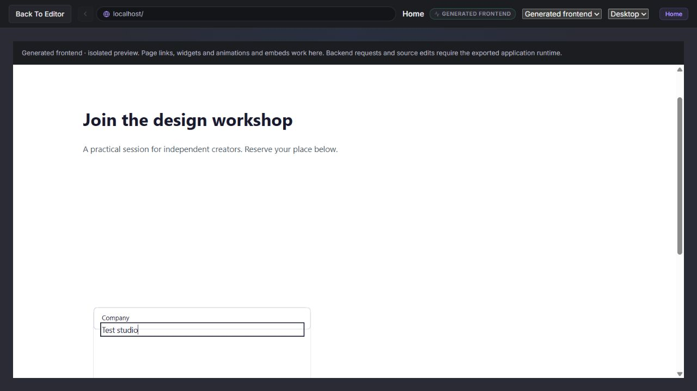
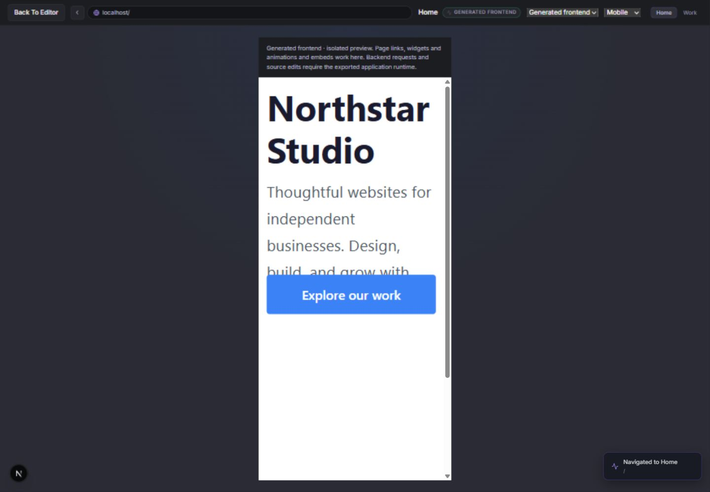
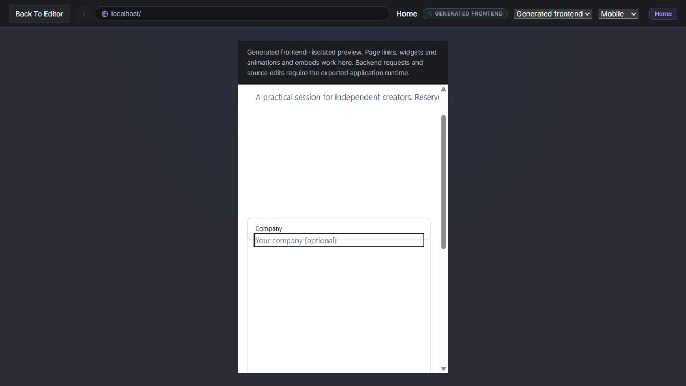
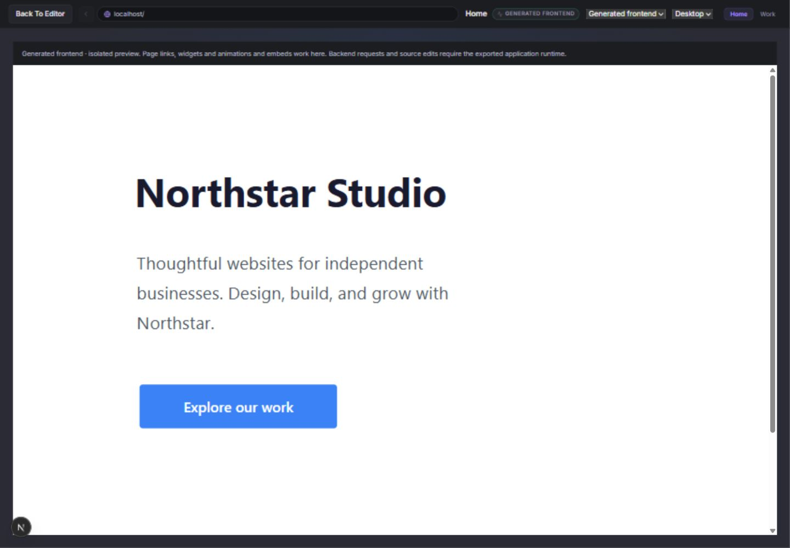

# Levoks local product audit — 8 October 2026

Implementation follow-up: [completed repairs and current backlog](product-implementation-progress.md). The findings and test results below describe the original audit before those changes.

Levoks has a working editor, persistence layer and substantial generated-application functionality. It is not yet ready for the promise that anyone can build a working website or application without code. The biggest immediate obstacles are broken default form layouts, unreliable automatic mobile layout and incomplete guidance from visual construction to a functioning, deployed application.

This audit evaluates the stated audience: people who should not need to understand CSS, API contracts, containers or database administration to succeed. No product implementation was changed. The examples and stress fixture were created locally; no site was published, no GitHub repository was changed and no paid model inference was requested.

## Evidence and scope

| Check | Result in this audit |
|---|---|
| TypeScript, lint and unit suite | Typecheck passed; lint: 0 errors, 50 warnings; 99 unit tests passed |
| Editor production build | Passed, installed Next.js 16.3.5 |
| Main Chromium E2E suite | 42/43 passed initially; one design selection failure; entire design file rerun passed 8/8 |
| Serial integration suite | 14 passed, 0 failed, 3 skipped; PostgreSQL/MySQL/MariaDB need disposable test URLs |
| Actual editor ZIP download → extracted canvas app | Download assertion passed; frontend/backend builds passed; real Next/Express/MongoDB and portable artifact runtime passed |
| Generated mapped-login app | Build and browser runtime passed, including validation and success-only navigation |
| Generated account app | Failed twice at unverified-email error presentation; later lifecycle steps were not reached |
| Generated design app | Production build and widget/responsive/motion runtime passed |
| Generated property/catalog app | Production build and runtime passed; tabs, radio keyboard behavior, controls, isolated embeds and catalog rendering/fill parity |
| Hands-on sites | Two projects built with actual catalog-to-canvas dragging; page navigation and local persistence exercised |
| Large editor fixture | 1,000 elements imported, rendered, selected, edited, saved and reloaded; retained edited text; captured browser warning/error log empty |
| Compiler bounds | 100–5,000 flat text nodes compiled without error diagnostics; oversized/deep/5,001-node inputs rejected |
| Local HTTP shell load | 800 home requests, concurrency up to 50, all HTTP 200 in the recorded second run |
| Dependency inventory | Production dependencies: 4 affected packages, including 1 critical; exported frontend pins an affected Next version |

The main suite covers home/library operations, guest and account isolation, cloud save conflicts, editor interactions, element census, properties, backend login/model/database/aggregation/rate-limit configuration, routing contracts, account UI and design tools. Integration tests exercise generated HTTP and real disposable MongoDB/SQLite, identity/recovery, observability, health, limits, vault, cloud concurrency, GitHub queue behavior and controlled AI streaming.

The catalog runtime is a rendering/style census, not proof of every property, state, action and accessibility requirement for every widget. Chromium was tested; Firefox, Safari/WebKit and physical mobile devices were not. External OAuth, hosted databases, GitHub, Vercel, real email delivery and live AI providers were excluded as requested. No full penetration test, distributed soak test or production capacity claim is made.

Logs are in `../.verification/audit-*.log`; traces and fixtures are in `../.verification/`. These paths are local ignored artifacts. Representative screenshots are preserved beside this report in `audit-2026-10-08/`.

## Confirmed defects and release priorities

P1 means fix before offering the affected workflow to ordinary users. P2 means significant usability/polish work. Dependency severity is reported separately from exploit reachability.

### 1. P1 — default Form controls overlap

**Reproduce:** Create a blank project, drag the legacy Form from Contact & Forms onto the canvas, then open Preview. The heading, name field, email field and Submit button occupy the same origin. Add a field with the form inspector: the new field overlays the existing controls too. This occurred in the workshop project on desktop and mobile.

Measured desktop children shared approximately x=148.2, y=446.9. Mobile children shared x=16.8, y=248.8. Filling/clicking the visible form did not establish successful submission because the overlapping field intercepted interaction.

**Cause:** `src/templates/legacy.ts` defines form children without a flow positioning mode. `src/store/editorStore.ts:267` defaults container children to absolute positioning. `src/components/PropertyInspector.tsx:804` adds fields with dimensions but no flow position. Generated frontend layout respects the resulting absolute positioning, so a flex form cannot lay out those children.

**Complete when:** A newly dragged Form and every added field render in usable sequence in canvas, preview and downloaded application at desktop/tablet/mobile widths. Submit remains below the fields; labels and keyboard order match visual order. Connect it to a generated endpoint and demonstrate valid, invalid, failure and successful submissions from that untouched starting template.

### 2. P1 — automatic mobile text layout allows overlap

**Reproduce:** Drag Title, Paragraph and Button into a desktop page. Use a multi-line paragraph with font size 32px and height 180px. Open Mobile preview. The paragraph wraps beyond its fixed height and the button is placed over the remaining text.

In the Northstar example at 375px: paragraph width 343.2px, client height 180px, scroll height 272px; CTA begins at y=400.8 while the paragraph starts at y=204.8. The content occupies more space than the layout allocates.

**Complete when:** Flow layout uses actual text height or appropriate auto/min-height defaults; following elements never cover text after wrapping. Warn about intentional fixed-height clipping and allow easy device-specific correction without requiring CSS knowledge.

### 3. P1 — nested section content remains too wide on mobile

**Reproduce:** Drag Contact Section, edit its heading/paragraph, switch to Mobile. The parent shrinks to roughly 343px but nested content retains 580px width; page overflow clips it.

**Complete when:** Nested templates constrain children to their available parent width and wrap text at mobile/tablet widths. Verify descendants, long content, padding and custom breakpoints in both preview and exported output. Explicit responsive controls passing tests do not eliminate this default-template defect.

### 4. P1 — generated account errors hide actionable recovery information

**Reproduce:** Run `npm run test:generated-e2e`. Registration succeeds; sign in before email verification. The test expects verification instructions, but the app displays “The request could not be completed.” This reproduced twice at `tests/generated-e2e/account.spec.ts:181`.

Network evidence: register 201 with `emailVerified:false`; login 403 with error code `forbidden` and the generic message. Access is correctly denied: this is a recovery/usability defect, not a demonstrated authentication bypass.

**Cause:** `src/lib/codegen/auth.ts:38` produces a verification-specific error, but `src/lib/codegen/observability.ts:78` replaces it with the fallback client message unless a classification rule supplies a message.

**Complete when:** Safe expected identity failures have stable public codes and useful messages/actions. Test verification resend, expired links, reset completion, refresh/replay/logout and invalid credentials through the generated browser UI. Existing backend lifecycle tests pass, but this browser run stopped before its remaining lifecycle assertions. The completion ledger's historical account pass does not describe this run.

### 5. Dependency maintenance — affected versions reach generated products

`npm audit --omit=dev --json` reported 4 affected production packages: 1 critical, 2 high, 1 moderate. The full development inventory reported 10 affected packages: 1 critical, 8 high, 1 moderate. The generated canvas frontend inventory reported Next as an affected direct dependency. These counts are affected-package counts, not counts of independently reachable exploits.

`src/lib/project/compiler.ts:157` pins generated Next to 16.3.5. The registry advisory inventory includes `GHSA-vcvr-r3jv-pc5j` for the Next ImageResponse path, with an affected range containing this version, alongside other Next advisories. This audit did not execute exploits or establish that every affected feature is used by Levoks.

**Complete when:** Upgrade editor and generator dependencies to reviewed patched versions, rebuild every export fixture, rerun tests and audit production/generated dependencies in CI. Keep generated artifacts reproducible with a lockfile/version policy. Do not use a blind force upgrade as acceptance.

### 6. P2 — added form field order and incomplete section guidance

Adding a Company field appends it after Submit in the child list. After fixing layout, it will still need an intentional insertion order. Contact Section creates heading/paragraph content rather than a working contact workflow. Hero's parent Content inspector exposes an empty properties group; users must discover and select nested children.

**Complete when:** Added fields precede submit, field ordering is straightforward, composite sections explain how to edit their contents, and “Contact” offers a usable form/inbox recipe or clearly states its scope.

### 7. Test reliability — intermittent design selection and conflicting runners

One main-suite design test expected two selected elements and found zero at `tests/e2e/design-tools.spec.ts:530`. The complete file passed on rerun. Treat this as intermittent selection/test synchronization evidence, not a proven persistent UI failure.

An initial parallel integration run also collided with the E2E server's `.next-e2e` lock and timed out waiting for identity runtime readiness. Independent reruns passed, followed by the complete serial integration run passing 14 runnable tests. Use distinct test server ports/dist directories and deterministic readiness checks before interpreting these as application failures.

## Websites actually built with drag and drop

| Local project | Actions and verified outcome | Limitations found |
|---|---|---|
| Audit — Northstar Studio | Dragged title, paragraph and CTA; edited typography/content; created Work page; dragged Hero; wired CTA to Work; preview navigated to `/work`; saved project remained in dashboard | Mobile paragraph/CTA overlap; composite editing guidance needs work |
| Audit — Workshop Signup | Dragged Contact Section and Form; edited nested copy; used Add Field and configured Company; reopened saved project with changes retained | Default form overlap, nested mobile clipping, new field placed after Submit; submission success not established |
| Stress 1000 (import) | Imported synthetic project through dashboard file picker; confirmed 1,000 rendered paragraphs; selected/edited text; saved and reloaded; edit persisted | Only flat text workload; not complex nested/animated/data-bound editor capacity acceptance |

The two site projects remain in this browser's guest IndexedDB at `http://127.0.0.1:3200`. They are tied to this browser profile/origin and are not cloud-published. Handcrafted backup download capture timed out in the browser tool; this is not evidence of an application download defect. The separate automated test successfully downloaded and executed a real editor ZIP.

## Stress measurements

Second recorded run; three compiler samples per size, median shown. These are synthetic flat text projects on this local machine. Concurrent build activity affected timings; the first run was faster. No memory ceiling or sustained leak measurement was performed.

| Elements | Serialized project | Compiler median | Generated output | Error diagnostics |
|---:|---:|---:|---:|---:|
| 100 | 40,155 bytes | 29.8ms | 200,830 bytes | 0 |
| 500 | 201,175 bytes | 91.5ms | 959,370 bytes | 0 |
| 1,000 | 402,576 bytes | 243.7ms | 1,908,075 bytes | 0 |
| 2,500 | 1,013,276 bytes | 545.7ms | 4,773,175 bytes | 0 |
| 5,000 | 2,032,776 bytes | 873.8ms | 9,553,475 bytes | 0 |

5,001 elements, nesting beyond 100 levels and a document exceeding 5MB were rejected with clear errors. At 5,000 elements, generated output is about 4.7 times serialized project size; future tests should track bundle size and client memory as well as compiler duration.

Home-shell HTTP p95 latency for 200 requests at each concurrency: 1 → 10.8ms; 10 → 44.3ms; 25 → 88.8ms; 50 → 176.2ms. All 800 returned 200. This says nothing about authenticated database write throughput or capacity of a deployed generated app.

## Features still incomplete or needing polish

This list combines reproduced findings above with source and completion-ledger review. “Incomplete” does not mean no implementation exists. Current scope is documented in `completion-matrix.md`; ledger statements about external providers remain unverified locally.

| Area | Existing usable foundation | Work remaining for a no-code product |
|---|---|---|
| Canvas and responsive design | Dragging, dimensions, style controls, breakpoints, motion, local design tokens, reusable shapes/components | Reliable default flow/nested responsive behavior; arbitrary breakpoints; broader transformed hierarchy/property parity; clearer selection/editing affordances |
| Element library | Catalog rendering and selected interactive widget behavior tested in preview and production | Every property/action/state acceptance; experimental element readiness; usable complete composites; semantic/accessibility/mobile coverage |
| Forms and data UI | Typed form mappings, validation, generated requests and response-to-text mappings | Fix starting forms; guided endpoint/database connection; data-backed repeater/grid/table/search/filter/pagination; file upload/storage execution |
| Routing/workflows | Page navigation, chained requests, success/failure handling and typed mappings | Broader output bindings; context-sensitive controls; understandable errors and visual execution inspection |
| Models and queries | MongoDB/SQLite CRUD, defaults, uniqueness, aggregation, transactions, policies, lifecycle tested | Relation inspector/runtime, joins, schema/data migrations; SQL identity/audit/shared-limit adapters; richer data mapping |
| Identity | JWT sessions, refresh rotation/replay, recovery and authorization backend tests | Fix public errors; complete browser lifecycle; administrative account/role management; generated OAuth/API-key strategies |
| Automation/realtime | Bounded branches/loops/try-catch/functions and HTTP blocks; product-specific GitHub worker and identity email outbox | General generated events/queues/jobs/workers/schedulers, retries, WebSockets/SSE/subscriptions and signed webhooks. Existing internal workers do not provide these app-builder features |
| Integrations | HTTP subset, identity email, process-local cache, encrypted secret vault | General email/SMS/payment flows, upload/download/object storage, distributed cache, complete headers/auth/retry contracts and cloud secret adapters |
| Local/cloud persistence | IndexedDB, revision checks, checkpoints, cloud ownership and concurrent saves | Durable history beyond session bounds, background/offline sync, recovery from eviction, multi-device conflict resolution, team permissions/collaboration |
| Assets | Local bounded image/font assets and export embedding | Hosted object storage/CDN, quotas, access control and deletion lifecycle; avoid media exhausting the 5MB project cap |
| Code/preview | Deterministic compiler, source analysis subset and isolated frontend HTML preview | Isolated actual full-stack build/runtime preview, edited-source execution, clearer regeneration boundaries and source/canvas reconciliation |
| AI | Proposal review, streaming/cancellation, controlled local provider tests | Live provider acceptance, durable spend ledger/budgets, richer semantic/dependency analysis. Specialized trained agents are not present; prioritize user outcomes before adding them |
| GitHub | PAT connection records, discovery, reviewed updates and durable worker logic | GitHub App/OAuth renewal, hunk review, remote-to-project conflict reconciliation and authorized real-provider/closed-tab acceptance |
| Deployment | Frontend Vercel workflow and backend Compose export | Guided frontend/backend/database deployment, environment secrets, domains/TLS, durable status, logs, readiness gates, release history/rollback, metrics and backups |
| Product/account | Dashboard, guest project management and account UI | Functional entitlements/billing if monetized; clear limits; onboarding and complete error/help/recovery journeys |
| Quality/operations | Meaningful unit/browser/generated/integration coverage | Cross-browser/device/accessibility acceptance, long-session/memory/soak tests, patched dependency CI and repeatable isolated test runners |

## Features to add, ranked by usefulness

1. **Outcome-based onboarding and complete editable recipes.** Start with “business website,” “collect leads,” “booking,” “member portal” or “internal data app.” Each recipe should include working navigation, responsive content, data/auth where appropriate and a clear finish path. A large raw element menu is not enough for this audience.
2. **A guided form-to-database/inbox flow.** Configure fields visually, choose where submissions go, generate safe defaults, test a submission and view it in an inbox/table. Make validation, spam protection and consent controls understandable.
3. **Reliable responsive flow defaults and a layout checker.** Warn about overlapping controls, clipped text, fixed-width children and inaccessible mobile targets. Offer a concrete visual correction with preview before applying it.
4. **A publish-readiness checklist with linked fixes.** Find unwired buttons, dead links, missing form destinations, invalid mappings, missing secrets, inaccessible names and unsupported export features. Clicking an issue should select the affected element or setting.
5. **A built-in data workspace.** Define collections visually, populate sample rows, inspect live records and bind lists/tables/cards without field-path jargon. Include loading, empty, permission-denied and failure states.
6. **A safe full-stack test environment.** Run the generated app with isolated sample data and local email/payment test substitutes. Show request outcomes in plain language and support reset/replay without editing code.
7. **Website SEO and sharing settings.** Per-page titles/descriptions, social previews, canonical URLs, sitemap/robots and language settings. Current generated layout uses project name and generic “Created with Levoks” description with `lang="en"` in `src/lib/project/compiler.ts:129`.
8. **A media manager suited to real sites.** Compression, responsive variants, alt-text reminders, font loading feedback and hosted assets with quotas. Keep backups and exports portable.
9. **Durable versions with visual compare and restore.** Named milestones, content/layout differences and one-click restore; explain conflicts using the changed fields instead of requiring technical reconciliation.
10. **A managed deployment and operations path.** Attach a domain, provision required services, configure secrets, inspect logs, rollback and restore data through guided screens. This is essential to the “no code” promise.
11. **Accessibility and localization assistance.** Check heading order, labels, contrast, keyboard interactions and reduced motion; support translated content and language-aware layouts.
12. **Simple site analytics and submission tracking.** Help users answer whether the site works: visits, CTA clicks, form success/failure and conversion. Use privacy-conscious defaults and explain any tracking choices.

Prioritize the first six plus the reproduced defects before broadening the block catalog. Demonstrating a complete lead-generation site and a simple authenticated CRUD app will be more persuasive than additional partially executable controls.

## Recommended acceptance sequence

1. Repair default forms and responsive templates; add regressions that start from untouched drag-and-drop templates, not manually corrected fixtures.
2. Correct generated account errors; rerun the entire account lifecycle and dependency-patched generated builds.
3. Accept two user journeys end to end: business site with working lead form, and member CRUD app with policies. Include desktop/mobile, save/restore, exported production behavior and actionable failures.
4. Run a dedicated isolated local soak: mixed nested layouts, large assets within bounds, many pages, repeated undo/redo, reconnects, multi-tab conflicts and long editing sessions; record memory and interaction latency.
5. In the later authorized external round, verify live OAuth/email/AI/GitHub/Vercel and disposable SQL providers. Exercise actual deployment, domains, rollback and backups rather than stopping at a successful API request.

The available automated checks have been run and the main workflows inspected. Remaining exclusions above should stay explicit; “everything works” or “production ready” would overstate the evidence.
