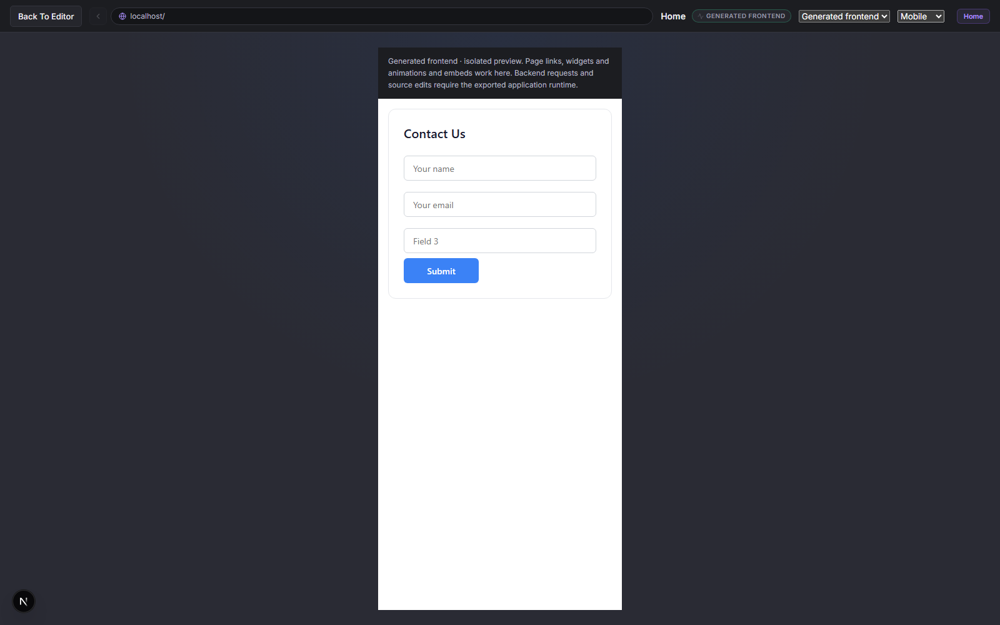
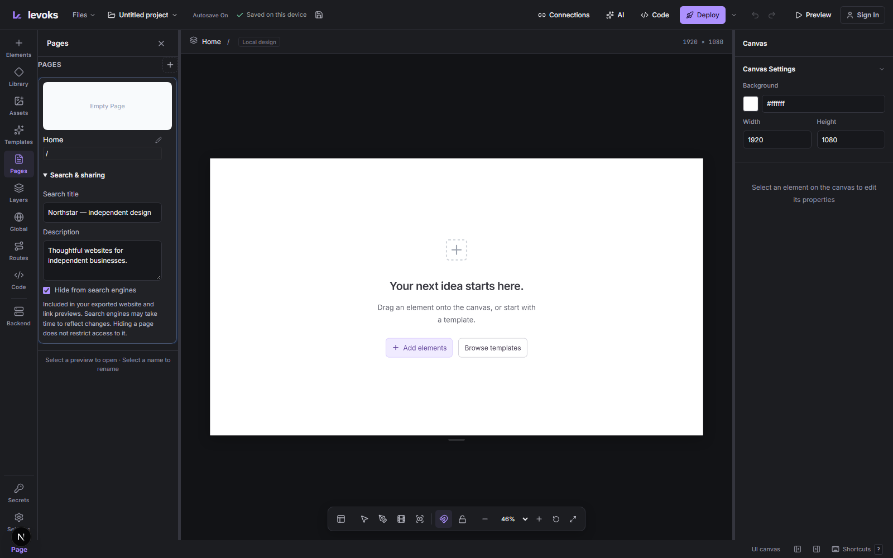
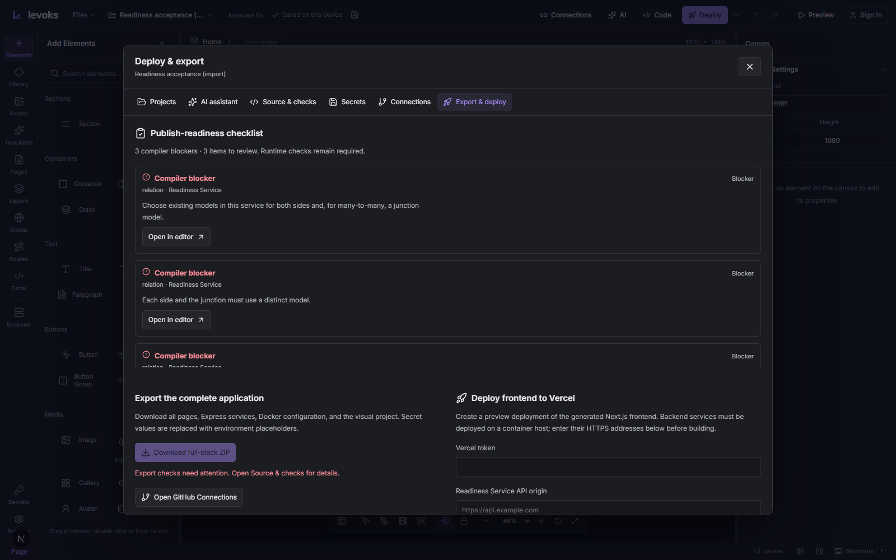
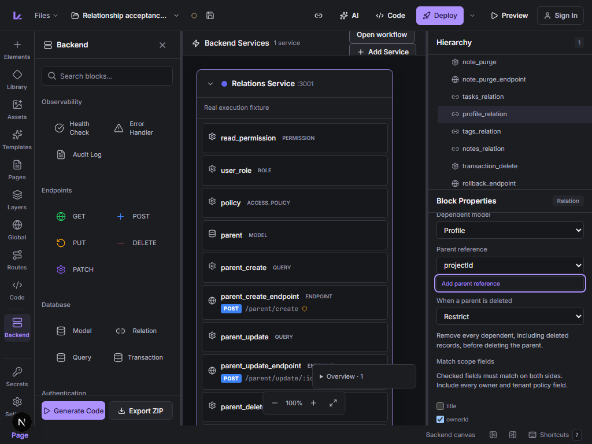

# Product implementation progress

This follows the [8 October local audit](local-product-audit-2026-10-08.md). The audit is a historical snapshot; the table below records changes implemented afterward. Larger feature families remain in the backlog.

## Implemented and verified locally

| Audit item | Result | Evidence |
|---|---|---|
| Default Form controls overlap | Newly created template children use normal flow when no explicit coordinates/position were supplied. Added legacy input fields precede the actual submit control. Containers with content can grow while preserving minimum dimensions and explicit height styles. | Untouched form browser test: separate controls in canvas, desktop preview and mobile preview. Unit test covers save/restore and field order. |
| Existing overlapping forms | Select the form → Content → Fields → **Arrange fields vertically**. This explicitly places its children in normal flow, moves Submit after fields and supports one-step undo. Existing saved designs are not silently rearranged. | Restore/repair/undo regression passed. |
| Mobile text overlap and nested clipping | The generated automatic mobile fallback keeps items from shrinking, allows text height to grow and constrains descendant widths. Static children in canvas/generated output also respect parent width. | Browser checks actual paragraph content height, button placement and section child bounds. Explicitly designed responsive layouts still require their own acceptance. |
| Generated account recovery message | Expected authored identity errors can provide safe public messages; verification-required errors have the `email_verification_required` code. Unexpected/internal errors retain the generic fallback; configured classification messages remain authoritative. | Full generated account browser journey passed: verification, cookie renewal, reset and session revocation. Real Express/Mongo observability integration passed. |
| Affected production dependencies | Updated editor and generator to Next 16.4.0, aligned ESLint configuration, refreshed compatible lockfile dependencies. | Editor and generated production builds pass. Editor production audit and regenerated account frontend/backend install audits report zero vulnerabilities. Development-only braces/tooling advisories remain; no force downgrade applied. |
| Per-page search and sharing settings | Pages → **Search & sharing** offers title, description and search indexing controls. Settings persist in project state/backups and generate server metadata, Open Graph and Twitter summary metadata. | Browser save/reload/download test and built generated-site checks for home and a separate page. This is the initial metadata feature; canonical URLs, social images, sitemap/robots and language settings remain. |
| Exported routes beginning with underscores | Generated page files and metadata layouts encode the leading underscore directory so Next does not treat it as private. | Built generated `/_work` page serves and has its own title/description/indexing settings. |
| Secret panel refresh | Loading metadata updates state after the asynchronous request and ignores responses from an obsolete mounted effect. | Typecheck/lint/build pass with upgraded hooks rules. |
| MongoDB resource relationships (BE06) | Editable one-to-one, one-to-many and explicit-junction many-to-many relations; undoable reference-field creation; owner/tenant scope matching; unique indexes; Restrict/Cascade/Unlink and restore/purge semantics. Generated mutations share transactions and a database lock across server replicas. | Browser configuration/undo/reload/download; actual downloaded Express/replica-set tests cover concurrent writes, scope denial, cardinality, rollback, restart and bounded cascades. SQL/cross-service/self relations, migrations and populated reads remain. |
| Publish readiness | Deploy & export lists compiler blockers, unwired forms/buttons, missing local links, page descriptions and runtime setup requirements. Review controls select/focus the affected setting; the checklist renders 20 rows initially on large projects. | Browser repairs relation/form/link/SEO, saves/reloads/downloads. A 1,000-element project confirms bounded rendered checks. Advisory findings do not gate export; a valid compilation does not certify deployment/runtime health. |
| Saved redirect buttons | The shared native tree emits safe links for legacy redirect settings. Link URL and legacy action editing clear the competing setting; disabled/loading links remain inactive. | Persistence/unsafe-URL unit coverage, property browser regression, and Enter-key navigation in a built exported Next website. API/scroll legacy actions still require supported Routing/page interactions. |
| Disabled wired actions | The shared generated handler exits before changing state or making requests when the target is disabled or aria-disabled, including link-shaped buttons. | Executed handler regressions verify that disabled controls never call the API; normal mapped forms retain their existing execution. |
| Endpoint request headers (BE03, RT02) | Persisted scalar metadata contracts, stable header mappings, bounded values, normalized workflow bindings and per-endpoint gateway forwarding. Browser/transport/authentication headers are reserved; undeclared workflow header bindings fail compilation. | Inspector invalid/repair/undo/reload/download; missing/malformed/repeated/control-character tests; real upstream forwarding isolation; actual downloaded login app enforces the required header before issuing a session. Rich response/error/status contracts remain. |
| Workflow response headers and bodyless statuses (BE03) | Editable metadata with string/number/boolean literals or public bindings; case-insensitive names, value limits, safe diagnostics and per-endpoint gateway forwarding. 204/205/304 send no body; conflicting 204/205 body contracts fail compilation; the client handles 205 successfully. | Invalid/repair/undo/save/reload/actual ZIP; executed handler checks failure before session issuance; real Express/gateway GET/HEAD status tests; production downloaded login metadata. Rich error/status schemas and header-to-view mappings remain. |
| CORS controls (BE46) | Origins, methods, automatic/custom allowed headers, exposed headers, credentials and preflight caching persist and emit through the installed cors middleware. Disallowed origins/methods/preflight headers fail closed; runtime origins are validated and normalized for identity checks. | Browser authoring/download, real HTTP preflight/denial cases, and generated browser calls across origins. Explicit origins and service scope only. These settings do not replace authentication/resource policies. |
| Backend field accessibility | Shared FieldRow associates direct native controls with their labels; collapsible sections announce expanded state. | Accessible-label queries work for CORS controls and existing login/relationship browser regressions. Full editor accessibility acceptance remains open. |
| Guided form destinations | Form → Content creates public write-only submission storage or maps to an existing POST/PUT/PATCH endpoint. Uses ordinary editable models/workflows/wires, required-field checks, stable identities and atomic history. Same-endpoint changes retain response/failure settings; failed creation restores all project definitions. | Real drag/drop → configuration → undo/redo/disconnect → save/reload → actual ZIP. Downloaded Next/Express/MongoDB stores records, rejects malformed input and managed-field injection, denies public reads/edits and enforces IP limits. Optional private inbox/first-operator setup is implemented below; broader operator administration and form workflows remain open. |
| Working contact form | Templates adds a name/email form plus connected submission storage while keeping existing canvas content. Authored confirmation and optional native reset run only after successful requests; failures retain input. Disabled fieldsets are excluded. | Template/additive-history browser test, executed generated handler tests and actual downloaded application retry/reset/mobile checks. This is an additive form starter, not a complete marketing-site template or full-stack editor preview. |
| Private submission inbox and first operator | Connected MongoDB forms can add a separate identity service, operator read policy and paginated built-in inbox in one undoable action. Runtime-only setup codes safely enroll one initial operator; account pages link to inboxes. Public writes remain open. | Actual drag/drop/save/reload/ZIP/build/runtime, concurrent two-process enrollment with one success, role injection denial, live roles, revoked/disabled sessions, escaped data, outages/retry and mobile bounds. Team administration, operator replacement, general live widgets and notifications remain. |

## First repair validation — 8 October

- `npm run check`: TypeScript passed, lint 0 errors/50 existing warnings, 102 unit tests passed.
- `npm run build`: production build passed on Next 16.4.0, including the final implementation changes.
- Focused product browser tests: 3/3 passed.
- Broader properties/workspace run: 11 passed, two initial failures; Tabs and AI streaming/cancellation both passed in the focused rerun with all 5 tests passing. Initial failures were a cold editor-entry timeout and a Generate-button interaction timeout under concurrent build activity. They are not recorded as proven fixed defects.
- `npm run test:generated-e2e`: complete generated account browser lifecycle passed.
- `npm run test:design-export`: generated build/runtime passed, including page metadata on home and `/_work`, widgets, responsive overrides and motion.
- Targeted repair and real observability regressions: 4/4 passed.
- `npm audit --omit=dev --json`: zero affected production packages at the time of the check. Five affected development tooling packages remain in the dependency chain reported by npm.

Logs are local ignored artifacts under `.verification/fix-*.log`. Screenshots below are preserved in the repository documentation directory. Tests did not call live external providers, publish sites or change remote repositories.

## Subsequent implementation verification — 8–9 October

The relation/readiness/redirect increment passed 110 unit tests, four focused browser cases, 16 integrations (three external SQL cases skipped), both production builds and execution of the actual relation ZIP. Header and CORS increments extend that evidence. Latest results and logs are recorded in [the completion matrix](completion-matrix.md); initial failures and their fixes are described there rather than counted as passes.

Latest combined verification: 115 unit tests; TypeScript and lint (0 errors/50 existing warnings); 17 integration tests passed and three external SQL cases skipped; editor and generated production builds; actual browser-downloaded header/CORS application; relationship, readiness, login and button property browser checks. Disabled-action regressions passed 14 focused checks in `.verification/disabled-actions-final.log`. All testing remains local, with no publication, remote repository writes or paid inference.

Continued response-metadata increment: 117 unit tests pass, as do TypeScript/lint (0 errors/50 existing warnings), 18 integrations (three external SQL cases skipped), the editor production build, inspector persistence/download and production execution of that downloaded login app. Real Express/gateway tests cover GET/HEAD and 200/201/204/205/304/418 output; malformed resolved values fail with safe errors. Actual browser checks confirm exposed metadata is readable across origins while unexposed headers and Set-Cookie stay hidden. The [matrix](completion-matrix.md) records exact logs and remaining response-contract work.

Continued guided-form increment: 120 unit tests pass, with TypeScript/lint (0 errors/50 existing warnings), 18 integrations (three external SQL cases skipped), seven form/mobile/metadata/routing browser regressions, three final form authoring cases, real execution of their downloaded Next/Express/MongoDB application, and editor/generated production builds. Records survive service restart; read/edit APIs are absent; invalid and managed-field values cannot corrupt the stored record. [The matrix](completion-matrix.md#guided-form-storage-and-working-contact-starter--2026-10-09) records initial test corrections and exact logs. The wider product plan remains open.

Private-inbox increment: 123 unit tests, TypeScript/lint, six editor browser regressions, 18 serial integrations (three external SQL cases skipped), editor production build, actual clean ZIP extraction and generated production builds/runtime. The reader and first-operator bootstrap pass concurrency, session/role denial, empty/error recovery and mobile checks. [The matrix](completion-matrix.md#private-submission-inbox-and-first-operator--2026-10-09) records exact evidence and remaining administration/notification boundaries.

## Next implementation priorities

1. Continue the business-site journey with submission notifications, broader field types and a complete site starter, then wider operator/team administration. A private inbox and safe first-operator setup are implemented and verified locally. Guided destination/database mapping and the additive working contact form are implemented; their supported boundaries are described in [form contracts](fullstack-contracts.md#guided-form-destinations).
2. Extend the implemented readiness checklist with executable full-stack preview checks after an isolated preview runtime exists.
3. Improve nested/composite editing and explicit responsive layout parity, including other form control types and long/complex content.
4. Add live data binding for collections/tables/repeaters with loading, empty and error states.
5. Provide isolated full-stack preview with sample data and test transports.
6. Complete managed frontend/backend/database deployment and operational workflows; verify external providers in the later authorized test round.

The detailed remaining models, authentication strategies, automation, realtime, storage, collaboration and deployment requirements are retained in [the audit](local-product-audit-2026-10-08.md) and [completion matrix](completion-matrix.md). They are not marked complete by these initial repairs.
